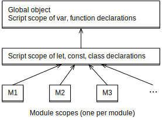

## 10 变量和赋值

> 原文： [http://exploringjs.com/impatient-js/ch_variables-assignment.html](http://exploringjs.com/impatient-js/ch_variables-assignment.html)
> 
> 贡献者：[so-hard](https://github.com/so-hard)

下面这些是 JavaScript 声明变量的主要方式：

* `let`用来声明可变变量。
* `const`用来声明常量（不可变变量）。

在ES6之前，还有`var`。但它有些怪癖，所以最好在现代JavaScript程序中避免使用它。你可以在[“Speaking JavaScript”](http://speakingjs.com/es5/ch16.html)中阅读更多相关信息。

### 10.1 `let`

通过`let`声明变量的值是可变的：

```js
let i;
i = 0;
i = i + 1;
assert.equal(i, 1);
````

你也可以声明变量后紧接着赋值：

```js
let i = 0
```

### 10.2 `const`

通过`const`声明的变量是不可变的。你必须立即给它初始化(赋值）：

```js
const i = 0;// 必须立即初始化
assert.throws({
    name: 'TypeError',
    message: 'Assignment to constant variable.',//赋值给常量
})
```

#### 10.2.1 `const`和不可变性

在JavaScript中，`const`只是表示这种*binding*（变量名和值之间的关联）是不可变。值本身可能是可变，如下例中的`obj`。

```js
const obj = { prop: 0 };
//允许： obj的prop属性值改变
obj.prop = obj.prop + 1;
assert.equal(obj.prop, 1);
// 不允许： 给obj赋值
assert.throws(
    () => { obj = {} },
    {
        name: 'TypeError',
        message: 'Assignment to constantvariable.',
    }
);
```

#### 10.2.2 `const`和循环

你可以将`const`与`for-of`循环一起使用，每次迭代都会有一个新的绑定被创建：

```js
const arr = ['hello', 'world'];
for (const elem of arr) {
    console.log(elem);
}
// Output:
// 'hello'
// 'world'
```

在普通的`for`循环中，必须使用`let`，however：

```js
const arr = ['hello', 'world'];
for (let i=0; i<arr.length; i++) {
    const elem = arr[i];
    console.log(elem);
}
```

### 10.3 在`let`和`const`之间做出决定

我推荐按以下规则来决定使用`let`或是`const`：

* `const`意味着固定的绑定，变量的值永远不会改变。用const就没错了。
* `let`表示变量的值发生变化。仅在不能使用const时才使用它。

 **练习：`const`**

`exercises/variables-assignment/const_exrc.js`

### 10.4 变量的作用域

变量的作用域是指该变量可以访被程序的区域。请思考下面代码。

```js
{ // // Scope A.  x（直接作用域）可被访问
  const x = 0;
  assert.equal(x, 0);
  { // Scope B. x, y可被访问
    const y = 1;
    assert.equal(x, 0);
    assert.equal(y, 1);
    { // Scope C. x, y, z可被访问
      const z = 2;
      assert.equal(x, 0);
      assert.equal(y, 1);
      assert.equal(z, 2);
    }
  }
}
//作用域外.  x, y, z不可被访问
assert.throws(
  () => console.log(x),
  {
    name: 'ReferenceError',
    message: 'x is not defined',
  }
);
```

* 作用域A是`x`的直接作用域。
* 作用域B和C在嵌套在作用域A的内部。
* 作用域A在作用域B和C的外面。

每个变量都可以被访问在它的直接作用域以及嵌套在它（直接作用域）内部的作用域。

通过const和let声明的变量称为块作用域，因为它们的作用域涵盖是最内层的块。

#### 10.4.1。遮蔽效应和块

你不能声明两次相同的变量在同一层级：

```js
assert.throws(
  () => {
    eval('let x = 1; let x = 2;');
  },
  {
    name: 'SyntaxError',
    message: "Identifier 'x' has already been declared",
  });
```

```js
assert.throws(
  () => {
    eval('let x = 1; let x = 2;');
  },
  {
    name: 'SyntaxError',
    message: "Identifier 'x' has already been declared",
  });
```

 **为什么`eval()`？**

我们需要通过 eval（）延迟解析，否则我们在解析此代码时会遇到异常。 `assert.throws()`仅在其函数体内抛出异常时才有效。

你可以`x`的块中嵌套一个块，并可以定义与外层块同名的变量：

```js
const x = 1;
assert.equal(x, 1);
{
    const x = 2;
    assert.equal(x, 2);
}
assert.equal(x, 1);
```

在内层块中，`x`是唯一具有该名称的可访问变量。内部`x`遮蔽外层`x`。离开块后，外层的`x`可以被访问。

 **测验：基本**

参见[测验应用程序](ch_quizzes-exercises.html#quizzes)。

### 10.5。 （高级）

所有剩余部分都是高级的。

### 10.6。术语：静态的与动态的

这两个形容词描述了编程语言中的现象：

* 静态：  某些内容与源码有关，在不执行代码的情况下确定。
* 动态： 表示运行时。

我们来看下面两个例子。

#### 10.6.1。静态现象：变量的作用域

变量作用域是一种静态现象。请思考以下代码：

```js
function f() {
  const x = 3;
  // ···
}
```

`x`是静态 （词法）作用域。也就是说，它的作用域是固定的，而且在运行时不会改变。

变量作用域成静态树（通过静态嵌套）。

#### 10.6.2。动态现象：函数调用

函数调用是一种动态现象。思考以下代码：

```js
function g(x) {}
function h(y) {
  if (Math.random()){// (A)
    g(y);
  }
}
```

函数是否被调用取决的A行，只能在运行时确定。

函数的调用形成动态树（通过动态调用）。

### 10.7 "暂时性死区”：避免访问未声明的变量

对于 JavaScript，TC39 （ 指的是技术委员会（Technical Committee）第39 号。它是ECMA 的一部分，ECMA 是“ECMAScript” 规范下的JavaScript 语言标准化的机构。）需要决定，如果在声明变量之前访问其直接作用域中的变量会发生什么：

```js
{
  console.log(x); // 这里将会打印什么
  let x;
}
```

一些可能的方法是：

1. 该变量被解析在当前作用域的作用域范围内。
2. 如果读取变量，你会得到`undefined`。你也可以给变量赋值。 （这就是`var`的工作原理。）
3. 抛出错误。

TC39 为`const`和`let`选择了（3），因为你可能犯错了，才会使用一个未申明的变量。 （2）不适用于`const`（其中每个变量应该具有初始化的值）。因此，`let`也被拒绝，因此两者的工作方式相似，并且很容易在它们之间切换。

在进入变量的作用域到变量的声明这段时间“暂时性死区”（TDZ）：

* 在此期间，变量被认为是未初始化的（就好像它是一个特殊值）。
* 如果访问未声明的变量，则会得到`ReferenceError`。
* 到变量声明后，变量获得初始值（通过赋值符号指定）或`undefined` - 如果没有赋初值。

以下代码表明了了“暂时性死区”（TDZ）：

```js
if (true) { // `tmp`作用域的起点, TDZ starts
  // `tmp` 未被初始化:
  assert.throws(() => (tmp = 'abc'), ReferenceError);
  assert.throws(() => console.log(tmp), ReferenceError);

  let tmp; // TDZ ends
  assert.equal(tmp, undefined);
}
```

接下来这个例子说明了“暂时性死区”是“暂时的”（与调用时间有关）：

```js
if (true) { // `myVar`作用域起点, TDZ starts
  const func = () => {
    console.log(myVar); // 稍后执行
  };

  // TDZ 内部:
  // 访问 `myVar` 会抛出 `ReferenceError`

  let myVar = 3; // TDZ 结束
  func(); // OK, 在 TDZ外调用
}
```

即使`func()`位于`myVar`声明之前并使用该变量，我们也可以调用`func()`。但是我们必须等到`myVar`的暂时死区结束。

### 10.8 提升

提升意味着一个构件会移动到作用域启始位置，而不管它位于作用域哪个位置：

```js
assert.equal(func(), 123); // Works!
function func() {
  return 123;
}
```

您可以在声明之前使用`func()`，因为在作用域内它会被提升。也就是说，上面的代码实际上是这样执行的：

```js
function func() {
  return 123;
}
assert.equal(func(), 123);
```

暂时性死区可以被视为提升的一种，因为声明会影响它的作用域起始发生什么。

**有关提升功能的更多信息**

有关提升如何影响功能的更多信息，请参阅[回调值](ch_callables.html#hoisting-functions)的章节。

### 10.9全局变量

如果一个变量声明在顶级作用域，那么它就是全局变量。每个内层作用域都可以访问全局变量。在JavaScript中，会有多个全局作用域（图 [5](#fig:global-scopes) ）：

* 最外层的全局作用域是特殊的：它的变量可以通过对象（全局对象）的属性所被访问。全局对象在浏览器环境中被称为window和self。此作用域的变量通过以下方式创建的：
  * 作为全局对象的属性
  * `var`和`function`在脚本的最上面声明的变量（*script*被浏览器支持。它们是简单的代码片段以及模块的前身。有关详细信息，请参阅[模块](ch_modules.html#scripts)的章节。）
* 嵌套在这个作用域内是脚本的全局作用域。此作用域中的变量由`let`，`const`和`class`在脚本的最上面声明。
* 嵌套在该作用域的是模块的作用域。每个模块都有自己的全局作用域。变量在该作用域被最上面的模块声明。



Figure 5: JavaScript有多个全局作用域。

#### 10.9.1。全局对象

全局对象允许您通过对象访问最外层的作用域。他们俩总是同步的：

* 如果在最外层的作用域中创建变量，则全局对象将获取新属性。如果更改这个全局变量，那么这个属性也会更改。
* 如果你创建或删除全局对象的属性，那么相应的也会创建或删除相应的全局变量。如果更改全局对象的属性，则相应的全局变量将更改。

全局对象可通过特殊变量获得：

* `window`：是引用全局对象的经典方式。但它只适用于普通的浏览器，不适用于*Node.js*和*Web Workers*（与浏览器代码同时运行的进程;有关详细信息，请参阅[关于异步编程的章节](ch_async-js.html#web-workers)）。
* `self`：在浏览器环境中随处可用，包括 Web Workers。但是 Node.js 不支持它。
* `global`：仅在 Node.js 中可用。

让我们来看看`self`是如何工作的：

```js
// 在脚本的最上面
var myGlobalVariable = 123;
assert.equal('myGlobalVariable' in self, true);

delete self.myGlobalVariable;
assert.throws(() => console.log(myGlobalVariable), ReferenceError);

// 随便在哪儿创建一个全局变量:
if (true) {
  self.anotherGlobalVariable = 'abc';
}
assert.equal(anotherGlobalVariable, 'abc');
```

#### 10.9.2。避免全局对象！

Brendan Eich称全局对象是他设计JavaScript最大的遗憾之一。不要将变量放在它的作用域：

* 通常，网页上所有脚本都是全局变量的话造成命名冲突。
* 通过全局对象，你可以在任何地方创建和删除全局变量。这样做会使代码无法预测，因为通常在嵌套作用域中无法进行此类更改。

你有时会在网络上的教程中看到`window.globalVariable`，但前缀“`window.`”不是必须的。我宁愿省略它：

```js
window.encodeURIComponent(str); // no
encodeURIComponent(str); // yes
```

### 10.10 闭包

在我们探索闭包之前，我们需要了解绑定变量和自由变量。

#### 10.10.1。绑定变量与自由变量

每个范围，都有一组提到的变量。在这些变量中我们区分：

* 绑定变量： 在作用域内声明。它们是参数或局部变量。
* 自由变量： 在作用域外声明。它们也被称为非局部变量。

请考虑以下代码：

```js
function func(x) {
  const y = 123;
  console.log(z);
}
```

在`func()`的主体中，`x`和`y`是绑定变量。 `z`是一个自由变量。

#### 10.10.2 什么是闭包？

什么是闭合呢？

> 闭包是一个函数加上与“出生地”存在的变量的连接。

维持这种连接有什么意义？它让函数自由变量的值可被访问。例如：

```js
function funcFactory(value) {
  return () => {
    return value;
  };
}

const func = funcFactory('abc');
assert.equal(func(), 'abc'); // (A)
```

`funcFactory`返回一个闭包赋值给`func`。当func在A行被调用时，它仍然能访问自由变量的值，因为func跟变量有关联，（即使不在它的作用域）。


**JavaScript中的所有函数都是闭包**

在JavaScript通过闭包支持静态作用域。因此，每个函数都是一个闭包。如果你对闭包的工作原理感兴趣，请参阅[“可变环境”](ch_remaining-chapters-preview.html)一章（如 ECMAScript 规范中所述）。

#### 10.10.3 示例：incrementors工厂

以下函数返回`incrementors`（作者创造的）。incrementor是内部存储数字的函数。它被调用后，通过向其添加参数来更新该数字并返回新值。

```js
function createInc(startValue) {
  return (step) => { // (A)
    startValue += step;
    return startValue;
  };
}
const inc = createInc(5);
assert.equal(inc(2), 7);
```

我们可以看到在A行创建的函数将其内部数字保存在自由变量`startValue`中。这一次，我们不只在它声明的作用域中读取，我们使用它来存储我们更改的数据以及在函数调用中持续存在的数据

我们可以通过局部变量在它声明的作用域内创建更多存储插槽：

```js
function createInc(startValue) {
  let index = -1;
  return (step) => {
    startValue += step;
    index++;
    return [index, startValue];
  };
}
const inc = createInc(5);
assert.deepEqual(inc(2), [0, 7]);
assert.deepEqual(inc(2), [1, 9]);
assert.deepEqual(inc(2), [2, 11]);
```

#### 10.10.4 闭包的应用

闭包的最佳实践

* 对于初学者来说，它们只是静态作用域的实现。因此，它们为回调提供上下文数据。

* 函数也可以使用它们来存储跨函数调用持久存在的状态。 `createInc()`就是一个例子。

* 并且它们可以为对象提供私有数据（通过字面值或类生成）。有关其工作原理的详细信息，请参见[“探索 ES6”](http://exploringjs.com/es6/ch_classes.html#_private-data-via-constructor-environments)。

### 10.11 总结：声明变量的方法

Table 1: 下面是所有声明变量的方法在JavaScript中。

|            | 提升     | 作用域 | Script作用域是全局对象？ |
|------------|----------|------|----------------------|
| `var`      | 仅声明   | 函数 | `✔`                  |
| `let`      | 时间死区 | 块级   | `✘`                  |
| `const`    | 时间死区 | 块级   | `✘`                  |
| `function` | 所有     | 块级   | `✔`                  |
| `class`    | 没有     | 块级   | `✘`                  |
| `import`   | 所有     | 模块  | `✘`                  |

TBL。 [1](#tbl:declaring-variables) 列出了在 JavaScript 中声明变量的所有方法：`var`，`let`，`const`，`function`，`class`和`import`。

 **测验：高级**

参见[测验应用程序](ch_quizzes-exercises.html#quizzes)。

### 10.12 进一步阅读

有关变量是如何被引擎处理的更多信息，请参阅[“可变环境”一章](ch_remaining-chapters-preview.html)。