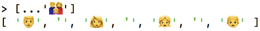
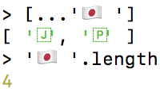

## 17\. Unicode - 简要介绍（高级）

> 原文： [http://exploringjs.com/impatient-js/ch_unicode.html](http://exploringjs.com/impatient-js/ch_unicode.html)
> 
> 贡献者：[飞龙](https://github.com/wizardforcel)

Unicode 是在世界上大多数书写系统中表示和管理文本的标准。几乎所有使用文本的现代软件都支持 Unicode。该标准由 Unicode Consortium 维护。该标准的新版本每年发布（带有新的 Emoji 等）。 Unicode 1 于 1991 年发布。

### 17.1。代码点与代码单元

两个概念对于理解 Unicode 至关重要：

*   代码点：是表示 Unicode 字符的数字。
*   代码单元：是具有固定大小的数据片段。一个或多个代码单元编码单个代码点。代码单元的大小取决于编码格式。最流行的格式 UTF-8 具有 8 位代码单元。

#### 17.1.1。代码点

Unicode 的第一个版本有 16 位代码点。从那时起，字符数量大大增加，代码点的大小扩展到 21 位。这 21 个位分为 17 个平面，每个平面 16 位：

*   平面 0：**基本多文种平面（BMP）**，0x0000-0xFFFF
    *   这是最常用的平面。粗略地说，它包含原始的 Unicode。
*   平面 1：多文种补充平面（SMP），0x10000-0x1FFFF
*   平面 2：表意文字补充平面（SIP），0x20000-0x2FFFF
*   平面 3-13：未分配
*   平面 14：特别用途补充平面（SSP），0xE0000-0xEFFFF
*   平面 15-16：私人用途补充区域（S PUA A / B），0x0F0000-0x10FFFF

平面 1-16 称为辅助平面或**星形平面**。

让我们检查几个字符的代码点：

```js
> 'A'.codePointAt(0).toString(16)
'41'
> 'ü'.codePointAt(0).toString(16)
'fc'
> 'π'.codePointAt(0).toString(16)
'3c0'
> '\u{1f642}'.codePointAt(0).toString(16)
'1f642'
```

代码点的十六进制数告诉我们前三个字符位于平面 0（16 位内）中，而表情符号位于平面 1 中。

#### 17.1.2。代码单元的编码格式：UTF-32，UTF-16，UTF-8

让我们介绍将代码点编码为代码单元的三种方法。

##### 17.1.2.1。 UTF-32（Unicode 转换格式 32）

UTF-32 使用 32 位来存储代码单元，从而每个代码点产生一个代码单元。这种格式是唯一具有*固定长度编码*的格式（所有其他格式使用不同数量的代码单元来编码单个代码点）。

##### 17.1.2.2。 UTF-16（Unicode 转换格式 16）

UTF-16 使用 16 位代码单元。它编码代码点如下：

*   BMP（Unicode 的前 16 位）：以单个代码单元存储。

*   星形平面：从 Unicode 的 0x110000 字符数减去 BMP 的 0x10000 个字符数后，保留 0x100000 个字符（20 位）。这些存储在 BMP 中未占用的“空隙”中：

    *   最高有效 10 位（*前导*）：0xD800-0xDBFF
    *   最低有效 10 位（*尾随*）：0xDC00-0xDFFF

因此，通过查看 UTF-16 代码单元，我们可以判断它是否是 BMP 字符，星体平面字符的前半部分（前导）或星形平面字符的后半部分（尾随）。

##### 17.1.2.3。 UTF-8（Unicode 转换格式 8）

UTF-8 具有 8 位代码单元。它使用 1-4 个代码单元来编码代码点：

| 代码点 | 代码单元 |
| --- | --- |
| 0000-007F | 0xxxxxxx（7 位） |
| 0080-07FF | 110xxxxx，10xxxxxx（5 + 6 位） |
| 0800-FFFF | 1110xxxx，10xxxxxx，10xxxxxx（4 + 6 + 6 位） |
| 10000-1FFFFF | 11110xxx，10xxxxxx，10xxxxxx，10xxxxxx（3 + 6 + 6 + 6 位） |

笔记：

*   每个代码单元的位前缀告诉我们：
    *   它是一系列代码单元中的第一个吗？如果是，将跟随多少代码单元？
    *   它是一系列代码单元中的第二个还是后面的？
*   0000-007F 范围内的字符映射与 ASCII 相同，这产生了与旧软件的向后兼容性。

### 17.2。 Web 开发：UTF-16 和 UTF-8

对于 Web 开发，两种 Unicode 编码格式是相关的：UTF-16 和 UTF-8。

#### 17.2.1。内部源代码：UTF-16

ECMAScript 规范在内部将源代码表示为 UTF-16。

#### 17.2.2。字符串：UTF-16

JavaScript 字符串中的字符是 UTF-16 代码单元：

```js
> const smiley = '\u{1f642}';
> smiley.length
2
> smiley === '\uD83D\uDE42' // code units
true
> smiley === '\u{1F642}' // code point
true
```

有关 Unicode 和字符串的更多信息，请参阅[字符串的文本原子](ch_strings.html#atoms-of-text)章节。

#### 17.2.3。文件中的源代码：UTF-8

当 JavaScript 存储在`.html`和`.js`文件中时，编码几乎总是 UTF-8：

```html
<!doctype html>
<html>
<head>
  <meta charset="UTF-8">
···
```

### 17.3。字形簇 - 真正的字符

一旦你考虑了世界上许多的书写系统，字符的概念就变得非常复杂。

一方面，代码点可以说代表 Unicode“字符”。

另一方面，存在*字形簇*。字形簇最接近于屏幕或纸张上显示的符号。它被定义为“可水平分段的文本单元”。编码字形簇需要一个或多个代码点。

例如，一个家族的一个表情符号由 7 个代码点组成 - 其中 4 个是字形本身，它们由不可见的代码点连接起来：



另一个例子是标志表情符号：



 **阅读：关于字形簇**的更多信息

有关更多信息，请参阅 Manish Goregaokar 的[“让我们停止将意义归于代码点”](https://manishearth.github.io/blog/2017/01/14/stop-ascribing-meaning-to-unicode-code-points/)。

 **测验**

参见[测验应用程序](ch_quizzes-exercises.html#quizzes)。
