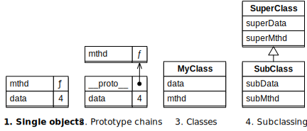

## 25.单个对象

> 原文： [http://exploringjs.com/impatient-js/ch_single-objects.html](http://exploringjs.com/impatient-js/ch_single-objects.html)
>
> 贡献者：[阿纯](https://github.com/rechun)

在本书中，JavaScript 的面向对象编程（OOP）风格分四步介绍。本章介绍步骤 1，[下一章](ch_proto-chains-classes.html)涵盖步骤 2-4。步骤是（图 [7](#fig:oop_steps1) ）：

1.  **单个对象：** _ 对象 _，JavaScript 的基本 OOP 构建块如何独立工作？
2.  原型链：每个对象都有一个零个或多个 _ 原型对象链 _。原型是 JavaScript 的核心继承机制。
3.  类：JavaScript 的 _ 类 _ 是对象的工厂。类及其实例之间的关系基于原型继承。
4.  子类化：_ 子类 _ 与其 _ 超类 _ 之间的关系也基于原型继承。



Figure 7: This book introduces object-oriented programming in JavaScript in four steps.


### 25.1。 JavaScript 中对象的两个角色

在 JavaScript 中，对象是一组称为 _ 属性 _ 的键值条目。

对象在 JavaScript 中扮演两个角色：

*   记录：作为记录的对象具有固定数量的属性，其密钥在开发时是已知的。它们的值可以有不同的类型。本章首先介绍了这种使用对象的方法。

*   字典：Objects-as-dictionaries 具有可变数量的属性，其密钥在开发时是未知的。它们的所有值都具有相同的类型。通常最好将映射用作词典而不是对象（本章稍后将对此进行介绍）。

### 25.2。对象作为记录

#### 25.2.1。对象字面值：属性

作为记录的对象是通过所谓的 _ 对象字面值 _ 创建的。对象字面值是 JavaScript 的一个突出特点：它们允许您直接创建对象。不需要上课！这是一个例子：

```js
const jane = {
  first: 'Jane',
  last: 'Doe', // optional trailing comma
};
```

在这个例子中，我们通过一个对象字面值创建了一个对象，它以花括号`{}`开头和结尾。在其中，我们定义了两个 _ 属性 _（键值条目）：

*   第一个属性具有键`first`和值`'Jane'`。
*   第二个属性具有键`last`和值`'Doe'`。

如果以这种方式编写它们，则属性键必须遵循 JavaScript 变量名称的规则，但允许使用保留字。

访问属性如下：

```js
assert.equal(jane.first, 'Jane'); // get property .first
jane.first = 'John'; // set property .first
assert.equal(jane.first, 'John');
```

#### 25.2.2。对象字面值：属性值缩写

每当通过变量名定义属性的值并且该名称与键相同时，您可以省略该键。

#### 25.2.3。术语：属性键，属性名称，属性符号

鉴于属性键可以是字符串和符号，因此进行以下区分：

```js
const x = 4;
const y = 1;

assert.deepEqual(
  { x, y },
  { x: x, y: y }
);
```

*   如果属性键是字符串，则它也称为 _ 属性名称 _。
*   如果属性键是符号，则它也称为 _ 属性符号 _。

此术语用于 JavaScript 标准库（“自己”表示“未继承”，将在下一章中介绍）：

*   `Object.keys(obj)`：返回`obj`的所有属性键
*   `Object.getOwnPropertyNames(obj)`
*   `Object.getOwnPropertySymbols(obj)`

#### 25.2.4。获得属性

这就是你 _ 得到 _（读）财产的方式：

```js
obj.propKey
```

如果`obj`没有其键为`propKey`的属性，则此表达式求值为`undefined`：

```js
const obj = {};
assert.equal(obj.propKey, undefined);
```

#### 25.2.5。设置属性

这就是你  设置 （写入）属性的方式：

```js
obj.propKey = value;
```

如果`obj`已经有一个键为`propKey`的属性，则此语句将更改该属性。否则，它会创建一个新属性：

```js
const obj = {};
assert.deepEqual(
  Object.keys(obj), []);

obj.propKey = 123;
assert.deepEqual(
  Object.keys(obj), ['propKey']);
```

#### 25.2.6。对象字面值：方法

以下代码显示如何通过对象字面值创建方法`.describe()`：

```js
const jane = {
  first: 'Jane', // data property
  says(text) {   // method
    return `${this.first} says “${text}”`; // (A)
  }, // comma as separator (optional at end)
};
assert.equal(jane.says('hello'), 'Jane says “hello”');
```

在方法调用`jane.says('hello')`期间，`jane`被称为方法调用的 _ 接收器 _，并被分配给特殊变量`this`。这使方法`.says()`能够访问 A 行中的兄弟属性`.first`。

#### 25.2.7。对象字面值：访问者

JavaScript 中有两种访问器：

*   _getter_ 是  调用 （读取）属性调用的方法。
*   _setter_ 是由  设置 （写入）属性调用的方法。

##### 25.2.7.1。getter

通过在方法定义前添加关键字`get`来创建 getter：

```js
const jane = {
  first: 'Jane',
  last: 'Doe',
  get full() {
    return `${this.first} ${this.last}`;
  },
};

assert.equal(jane.full, 'Jane Doe');
jane.first = 'John';
assert.equal(jane.full, 'John Doe');
```

##### 25.2.7. setter

通过在方法定义前添加关键字`set`来创建 setter：

```js
const jane = {
  first: 'Jane',
  last: 'Doe',
  set full(fullName) {
    const parts = fullName.split(' ');
    this.first = parts[0];
    this.last = parts[1];
  },
};

jane.full = 'Richard Roe';
assert.equal(jane.first, 'Richard');
assert.equal(jane.last, 'Roe');
```

 **练习：通过对象字面值创建对象**

`exercises/single-objects/color_point_object_test.js`

### 25.3。传播到对象字面值（`...`）

我们已经看到在函数调用中使用扩展（`...`），它将迭代的内容转换为参数。

在对象字面值内部，扩展属性 将另一个对象的属性添加到当前对象：

```js
> const obj = {foo: 1, bar: 2};
> {...obj, baz: 3}
{ foo: 1, bar: 2, baz: 3 }
```

如果属性键发生冲突，则上次提到的属性为“wins”：

```js
> const obj = {foo: 1, bar: 2, baz: 3};
> {...obj, foo: true}
{ foo: true, bar: 2, baz: 3 }
> {foo: true, ...obj}
{ foo: 1, bar: 2, baz: 3 }
```

#### 25.3.1。传播的用例：复制对象

您可以使用 spread 来创建对象的副本`original`：

```js
const copy = {...original};
```

警告 - 复制是 浅 ：`copy`是一个新对象，带有`original`的所有属性（键值对）的副本。但是如果属性值是对象，那么不会复制它们;它们在`original`和`copy`之间共享。以下代码演示了这意味着什么。

```js
const original = { a: 1, b: {foo: true} };
const copy = {...original};

// The first level is a true copy:
assert.deepEqual(
  copy, { a: 1, b: {foo: true} });
original.a = 2;
assert.deepEqual(
  copy, { a: 1, b: {foo: true} }); // no change

// Deeper levels are not copied:
original.b.foo = false;
// The value of property `b` is shared
// between original and copy.
assert.deepEqual(
  copy, { a: 1, b: {foo: false} });
```

 ** JavaScript 不做深拷贝**

_ 对象的深拷贝 _（所有级别都被复制）是众所周知的难以做到的。因此，JavaScript 没有内置的操作（暂时）。如果您需要这样的操作，则必须自己实现。

#### 25.3.2。传播的用例：缺失属性的默认值

如果代码的其中一个输入是包含数据的对象，则可以在为其指定默认值时使属性成为可选属性。这样做的一种技术是通过其属性包含默认值的对象。在以下示例中，该对象是`DEFAULTS`：

```js
const DEFAULTS = {foo: 'a', bar: 'b'};
const providedData = {foo: 1};

const allData = {...DEFAULTS, ...providedData};
assert.deepEqual(allData, {foo: 1, bar: 'b'});
```

结果，对象`allData`是通过创建`DEFAULTS`的副本并用`providedData`覆盖其属性来创建的。

但是您不需要对象来指定默认值，您也可以单独在对象字面值中指定它们：

```js
const providedData = {foo: 1};

const allData = {foo: 'a', bar: 'b', ...providedData};
assert.deepEqual(allData, {foo: 1, bar: 'b'});
```

#### 25.3.3。用例传播：非破坏性变化的属性

到目前为止，我们遇到了一种更改对象属性的方法：我们 _ 设置 _ 并改变对象。也就是说，这种改变属性的方式是 _ 破坏性 _

通过传播，您可以非破坏性地更改属性：您可以复制属性具有不同值的对象。

例如，此代码非破坏性地更新属性`.foo`：

```js
const obj = {foo: 'a', bar: 'b'};
const updatedObj = {...obj, foo: 1};
assert.deepEqual(updatedObj, {foo: 1, bar: 'b'});
```

 **练习：通过传播（固定密钥）非破坏性更新属性**

`exercises/single-objects/update_name_test.js`

### 25.4。方法

#### 25.4.1。方法是值为函数的属性

让我们重温一下用于介绍方法的示例：

```js
const jane = {
  first: 'Jane',
  says(text) {
    return `${this.first} says “${text}”`;
  },
};
```

有些令人惊讶的是，方法是函数：

```js
assert.equal(typeof jane.says, 'function');
```

这是为什么？请记住，在[关于可调用实体](ch_callables.html#roles-of-ordinary-functions)的章节中，我们了解到普通函数扮演了几个角色。 _ 方法 _ 是其中一个角色。因此，在引擎盖下，`jane`大致如下所示。

```js
const jane = {
  first: 'Jane',
  says: function (text) {
    return `${this.first} says “${text}”`;
  },
};
```

#### 25.4.2。 `.call()`：显式参数`this`

请记住，每个函数`someFunc`也是一个对象，因此有方法。一种这样的方法是`.call()` - 它允许您在明确指定`this`时调用函数：

```js
someFunc.call(thisValue, arg1, arg2, arg3);
```

##### 25.4.2.1。方法和`.call()`

如果进行方法调用，`this`始终是隐式参数：

```js
const obj = {
  method(x) {
    assert.equal(this, obj); // implicit parameter
    assert.equal(x, 'a');
  },
};

obj.method('a');
// Equivalent:
obj.method.call(obj, 'a');
```

顺便说一句，这意味着实际上有两个不同的点运算符：

1.  一个用于访问属性：`obj.prop`
2.  一个用于进行方法调用：`obj.prop()`

它们的不同之处在于（2）不仅仅是（1），后面是函数调用运算符`()`。相反，（2）另外指定`this`的值（如前面的例子所示）。

##### 25.4.2.2。功能和`.call()`

但是，如果函数调用普通函数，`this`也是一个隐式参数：

```js
function func(x) {
  assert.equal(this, undefined); // implicit parameter
  assert.equal(x, 'a');
}

func('a');
// Equivalent:
func.call(undefined, 'a');
```

也就是说，在函数调用期间，普通函数具有`this`，但它被设置为`undefined`，这表示它在这里没有真正的用途。

接下来，我们将研究使用`this`的缺陷。在我们能够做到这一点之前，我们还需要一个工具：函数的方法`.bind()`。

#### 25.4.3。 `.bind()`：预填充`this`和功能参数

`.bind()`是函数对象的另一种方法。调用此方法如下。

```js
const boundFunc = someFunc.bind(thisValue, arg1, arg2, arg3);
```

`.bind()`返回一个新函数`boundFunc()`。调用该函数调用`someFunc()`并将`this`设置为`thisValue`并且这些参数：`arg1`，`arg2`，`arg3`，然后是`boundFunc()`的参数。

也就是说，以下两个函数调用是等效的：

```js
boundFunc('a', 'b')
someFunc.call(thisValue, arg1, arg2, arg3, 'a', 'b')
```

另一种预填`this`和参数的方法是通过箭头功能：

```js
const boundFunc2 = (...args) =>
  someFunc.call(thisValue, arg1, arg2, arg3, ...args);
```

因此，`.bind()`可以实现为如下的实际功能：

```js
function bind(func, thisValue, ...boundArgs) {
  return (...args) =>
    func.call(thisValue, ...boundArgs, ...args);
}
```

##### 25.4.3.1。示例：绑定实际函数

将`.bind()`用于实际功能有点不直观，因为你必须为`this`提供一个值。该值通常是`undefined`，反映了函数调用期间发生的情况。

在下面的示例中，我们通过将`add()`的第一个参数绑定到`8`来创建`add8()`，这是一个具有一个参数的函数。

```js
function add(x, y) {
  return x + y;
}

const add8 = add.bind(undefined, 8);
assert.equal(add8(1), 9);
```

##### 25.4.3.2。示例：绑定方法

在下面的代码中，我们将方法`.says()`转换为独立函数`func()`：

```js
const jane = {
  first: 'Jane',
  says(text) {
    return `${this.first} says “${text}”`; // (A)
  },
};

const func = jane.says.bind(jane, 'hello');
assert.equal(func(), 'Jane says “hello”');
```

通过`.bind()`将`this`设置为`jane`至关重要。否则，`func()`将无法正常工作，因为在行 A 中使用了`this`。

#### 25.4.4。 `this`陷阱：提取方法

我们现在对函数和方法有了很多了解，并准备好了解涉及方法和`this`的最大缺陷：如果你不小心，函数调用从对象中提取的方法可能会失败。

在下面的例子中，当我们提取方法`jane.says()`时，我们失败，将它存储在变量`func`和函数调用`func()`中。

```js
const jane = {
  first: 'Jane',
  says(text) {
    return `${this.first} says “${text}”`;
  },
};
const func = jane.says; // extract the method
assert.throws(
  () => func('hello'), // (A)
  {
    name: 'TypeError',
    message: "Cannot read property 'first' of undefined",
  });
```

A 行中的函数调用相当于：

```js
assert.throws(
  () => jane.says.call(undefined, 'hello'), // `this` is undefined!
  {
    name: 'TypeError',
    message: "Cannot read property 'first' of undefined",
  });
```

那么我们如何解决这个问题呢？我们需要使用`.bind()`来提取方法`.says()`：

```js
const func2 = jane.says.bind(jane);
assert.equal(func2('hello'), 'Jane says “hello”');
```

当我们调用`func()`时，`.bind()`确保`this`始终为`jane`。

您还可以使用箭头函数来提取方法：

```js
const func3 = text => jane.says(text);
assert.equal(func3('hello'), 'Jane says “hello”');
```

##### 25.4.4.1。示例：提取方法

以下是您在实际 Web 开发中可能看到的代码的简化版本：

```js
class ClickHandler {
  constructor(elem) {
    elem.addEventListener('click', this.handleClick); // (A)
  }
  handleClick(event) {
    alert('Clicked!');
  }
}
```

在 A 行中，我们没有正确提取方法`.handleClick()`。相反，我们应该这样做：

```js
elem.addEventListener('click', this.handleClick.bind(this));
```

 **练习：提取方法**

`exercises/single-objects/method_extraction_exrc.js`

#### 25.4.5。 `this`陷阱：意外遮蔽`this`

如果使用普通功能，意外遮蔽`this`只是一个问题。

请考虑以下问题：当您在普通函数内部时，您无法访问周围范围的`this`，因为普通函数有自己的`this`。换句话说：内部作用域中的变量将变量隐藏在外部作用域中。这被称为 _ 阴影 _。以下代码是一个示例：

```js
const obj = {
  name: 'Jane',
  sayHiTo(friends) {
    return friends.map(
      function (friend) { // (A)
        return `${this.name} says hi to ${friend}`; // (B)
      });
  }
};
assert.throws(
  () => obj.sayHiTo(['Tarzan', 'Cheeta']),
  {
    name: 'TypeError',
    message: "Cannot read property 'name' of undefined",
  });
```

为什么错误？ B 行中的`this`不是`.sayHiTo()`的`this`，它是从 B 行开始的普通函数的`this`。

有几种方法可以解决这个问题。最简单的方法是使用箭头函数 - 它没有自己的`this`，因此阴影不是问题。

```js
const obj = {
  name: 'Jane',
  sayHiTo(friends) {
    return friends.map(
      (friend) => {
        return `${this.name} says hi to ${friend}`;
      });
  }
};
assert.deepEqual(
  obj.sayHiTo(['Tarzan', 'Cheeta']),
  ['Jane says hi to Tarzan', 'Jane says hi to Cheeta']);
```

#### 25.4.6。避免`this`的陷阱

我们已经看到了两个与`this`相关的重大陷阱：

1.  [提取方法](ch_single-objects.html#this-pitfall-extracting-methods)
2.  [意外遮蔽`this`](ch_single-objects.html#this-pitfall-shadowing)

一个简单的规则有助于避免第二个陷阱：

> “避免关键字`function`”：绝不使用普通函数，只使用箭头函数（用于实际函数）和方法定义。

让我们打破这个规则：

*   如果所有实际函数都是箭头函数，则第二个陷阱永远不会发生。
*   使用方法定义意味着您只能在方法中看到`this`，这使得此功能不那么混乱。

但是，即使我不使用（普通）函数 _ 表达式 _，我还是在语法上喜欢函数 _ 声明 _。如果您没有参考其中的`this`，您可以安全地使用它们。检查工具 ESLint 有[规则](https://eslint.org/docs/rules/no-invalid-this)，有助于此。

唉，第一个陷阱没有简单的方法：每当你提取一个方法时，你必须小心并正确地做到这一点。例如，通过绑定`this`。

#### 25.4.7。 `this`在各种情况下的值

`this`在各种情况下的值是多少？

在可调用实体中，`this`的值取决于调用可调用实体的方式以及它是什么类型的可调用实体：

*   功能调用：
    *   普通功能：`this === undefined`
    *   箭头功能：`this`与周围范围相同（词汇`this`）
*   方法调用：`this`是呼叫接收方
*   `new`：`this`是指新创建的实例

您还可以在所有常见的顶级范围中访问`this`：

*   `<script>`元素：`this === window`
*   ES 模块：`this === undefined`
*   CommonJS 模块：`this === module.exports`

但是，我喜欢假装您无法访问顶级作用域中的`this`，因为顶级`this`令人困惑且没有用处。

### 25.5。对象作为词典

对象最适合作为记录。但在 ES6 之前，JavaScript 没有字典的数据结构（ES6 带来了映射）。因此，必须将对象用作字典。因此，键必须是字符串，但值可以是任意类型。

我们首先看一下与字典相关的对象的特征，但偶尔也可用于对象作为记录。本节最后提供了实际使用对象作为词典的提示（剧透：如果可以，请避免使用映射）。

#### 25.5.1。任意固定字符串作为属性键

从对象作为记录到对象作为字典时，一个重要的变化是我们必须能够使用任意字符串作为属性键。本小节解释了如何实现固定字符串键。下一小节将介绍如何动态计算任意键。

到目前为止，我们只看到合法的 JavaScript 标识符作为属性键（符号除外）：

```js
const obj = {
  mustBeAnIdentifier: 123,
};

// Get property
assert.equal(obj.mustBeAnIdentifier, 123);

// Set property
obj.mustBeAnIdentifier = 'abc';
assert.equal(obj.mustBeAnIdentifier, 'abc');
```

两种技术允许我们使用任意字符串作为属性键。

首先 - 当通过对象字面值创建属性键时，我们可以引用属性键（带单引号或双引号）：

```js
const obj = {
  'Can be any string!': 123,
};
```

第二 - 获取或设置属性时，我们可以使用带有字符串的方括号：

```js
// Get property
assert.equal(obj['Can be any string!'], 123);

// Set property
obj['Can be any string!'] = 'abc';
assert.equal(obj['Can be any string!'], 'abc');
```

您还可以引用方法的键：

```js
const obj = {
  'A nice method'() {
    return 'Yes!';
  },
};

assert.equal(obj['A nice method'](), 'Yes!');
```

#### 25.5.2。计算属性键

到目前为止，我们受到了对象字面值内部属性键的限制：它们总是固定的，它们总是字符串。如果我们将表达式放在方括号中，我们可以动态计算任意键：

```js
const obj = {
  ['Hello world!']: true,
  ['f'+'o'+'o']: 123,
  [Symbol.toStringTag]: 'Goodbye', // (A)
};

assert.equal(obj['Hello world!'], true);
assert.equal(obj.foo, 123);
assert.equal(obj[Symbol.toStringTag], 'Goodbye');
```

计算键的主要用例是将符号作为属性键（行 A）。

请注意，用于获取和设置属性的方括号运算符适用于任意表达式：

```js
assert.equal(obj['f'+'o'+'o'], 123);
assert.equal(obj['==> foo'.slice(-3)], 123);
```

方法也可以有计算属性键：

```js
const methodKey = Symbol();
const obj = {
  [methodKey]() {
    return 'Yes!';
  },
};

assert.equal(obj[methodKey](), 'Yes!');
```

我们现在切换回固定属性键，但如果需要计算属性键，则可以始终使用方括号。

 **练习：通过传播非破坏性更新属性（计算密钥）**

`exercises/single-objects/update_property_test.js`

#### 25.5.3。 `in`运算符：是否存在具有给定键的属性？

`in`运算符检查对象是否具有给定键的属性：

```js
const obj = {
  foo: 'abc',
  bar: false,
};

assert.equal('foo' in obj, true);
assert.equal('unknownKey' in obj, false);
```

##### 25.5.3.1。通过真实性检查财产是否存在

您还可以使用真实性检查来确定属性是否存在：

```js
assert.equal(
  obj.unknownKey ? 'exists' : 'does not exist',
  'does not exist');
assert.equal(
  obj.foo ? 'exists' : 'does not exist',
  'exists');
```

之前的检查有效，因为读取不存在的属性会返回`undefined`，这是假的。因为`obj.foo`是真实的。

但是，有一个重要的警告：如果属性存在，则真实性检查失败，但具有假值（`undefined`，`null`，`false`，`0`，`""`等）：

```js
assert.equal(
  obj.bar ? 'exists' : 'does not exist',
  'does not exist'); // should be: 'exists'
```

#### 25.5.4。删除属性

您可以通过`delete`运算符删除属性：

```js
const obj = {
  foo: 123,
};
assert.deepEqual(Object.keys(obj), ['foo']);

delete obj.foo;

assert.deepEqual(Object.keys(obj), []);
```

#### 25.5.5。字典陷阱

如果使用普通对象（通过对象字面值创建）作为字典，则必须注意两个陷阱。

第一个缺陷是`in`运算符还找到了继承的属性：

```js
const dict = {};
assert.equal('toString' in dict, true);
```

我们希望`dict`被视为空，但`in`运算符会检测它从原型`Object.prototype`继承的属性。

第二个缺陷是你不能使用属性键`__proto__`，因为它具有特殊的权力（它设置了对象的原型）：

```js
const dict = {};

dict['__proto__'] = 123;
// No property was added to dict:
assert.deepEqual(Object.keys(dict), []);
```

那么我们如何解决这些陷阱呢？

*   只要你可以，使用映射。它们是词典的最佳解决方案。

*   如果你不能：将库用于可以安全地完成所有操作的对象字典。

*   如果你不能：使用没有原型的对象。这消除了现代 JavaScript 中的两个陷阱。

    ```js
    const dict = Object.create(null); // no prototype

    assert.equal('toString' in dict, false);

    dict['__proto__'] = 123;
    assert.deepEqual(Object.keys(dict), ['__proto__']);
    ```

 **练习：使用对象作为字典**

`exercises/single-objects/simple_dict_test.js`

#### 25.5.6。列出属性键

Table 19: Standard library methods for listing _own_ (non-inherited) property keys. All of them return Arrays with strings and/or symbols.

|  | 枚举 | 没有。 | 串 | 符号 |
| --- | --- | --- | --- | --- |
| `Object.keys()` | `✔` |  | `✔` |  |
| `Object.getOwnPropertyNames()` | `✔` | `✔` | `✔` |  |
| `Object.getOwnPropertySymbols()` | `✔` | `✔` |  | `✔` |
| `Reflect.ownKeys()` | `✔` | `✔` | `✔` | `✔` |

tbl 中的每个方法。 [19](#tbl:listing-property-keys) 返回一个带有参数自身属性键的数组。在方法的名称中，您可以看到我们之前讨论过的属性键（字符串和符号），属性名称（仅字符串）和属性符号（仅符号）之间的区别。

可枚举性是属性的 _ 属性 _。默认情况下，属性是可枚举的，但有一些方法可以改变它（在下一个示例中显示，[稍后将详细描述](ch_single-objects.html#property-attributes)）。

例如：

```js
const enumerableSymbolKey = Symbol('enumerableSymbolKey');
const nonEnumSymbolKey = Symbol('nonEnumSymbolKey');

// We create the enumerable properties via an object literal
const obj = {
  enumerableStringKey: 1,
  [enumerableSymbolKey]: 2,
}

// For the non-enumerable properties,
// we need a more powerful tool:
Object.defineProperties(obj, {
  nonEnumStringKey: {
    value: 3,
    enumerable: false,
  },
  [nonEnumSymbolKey]: {
    value: 4,
    enumerable: false,
  },
});

assert.deepEqual(
  Object.keys(obj),
  [ 'enumerableStringKey' ]);
assert.deepEqual(
  Object.getOwnPropertyNames(obj),
  [ 'enumerableStringKey', 'nonEnumStringKey' ]);
assert.deepEqual(
  Object.getOwnPropertySymbols(obj),
  [ enumerableSymbolKey, nonEnumSymbolKey ]);
assert.deepEqual(
  Reflect.ownKeys(obj),
  [ 'enumerableStringKey',
    'nonEnumStringKey',
    enumerableSymbolKey,
    nonEnumSymbolKey ]);
```

#### 25.5.7。通过`Object.values()`列出属性值

`Object.values()`列出对象的所有可枚举属性的值：

```js
const obj = {foo: 1, bar: 2};
assert.deepEqual(
  Object.values(obj),
  [1, 2]);
```

#### 25.5.8。通过`Object.entries()`列出属性条目

`Object.entries()`列出了可枚举属性的键值对。每对编码为一个双元素数组：

```js
const obj = {foo: 1, bar: 2};
assert.deepEqual(
  Object.entries(obj),
  [
    ['foo', 1],
    ['bar', 2],
  ]);
```

 **练习：`Object.entries()`**

`exercises/single-objects/find_key_test.js`

#### 25.5.9。确定性地列出属性

对象的自有（非继承）属性始终按以下顺序列出：

1.  具有整数索引的属性（例如，数组索引）

*   按升序数字顺序

1.  带字符串键的剩余属性

*   按照添加顺序

1.  带符号键的属性

*   按照添加顺序

以下示例演示如何根据以下规则对属性键进行排序：

```js
> Object.keys({b:0,a:0, 2:0,1:0})
[ '1', '2', 'b', 'a' ]
```

（[您可以在规格中查找详细信息。](https://tc39.github.io/ecma262/#sec-ordinaryownpropertykeys)）

#### 25.5.10。通过`Object.fromEntries()`组装对象

给定[key，value]对可迭代，`Object.fromEntries()`创建一个对象：

```js
assert.deepEqual(
  Object.fromEntries([['foo',1], ['bar',2]]),
  {
    foo: 1,
    bar: 2,
  }
);
```

它与 [`Object.entries()`](ch_single-objects.html#Object.entries) 相反。

接下来，我们将使用`Object.entries()`和`Object.fromEntries()`从库 [Underscore](https://underscorejs.org) 中实现多个工具功能。

##### 25.5.10.1。示例：`pick(object, ...keys)`

[`pick()`](https://underscorejs.org/#pick) 从`object`中删除其键不在`keys`中的所有属性。删除 _ 非破坏性 _：`pick()`创建修改后的副本并且不会更改原始文件。例如：

```js
const address = {
  street: 'Evergreen Terrace',
  number: '742',
  city: 'Springfield',
  state: 'NT',
  zip: '49007',
};
assert.deepEqual(
  pick(address, 'street', 'number'),
  {
    street: 'Evergreen Terrace',
    number: '742',
  }
);
```

我们可以按如下方式实现`pick()`：

```js
function pick(object, ...keys) {
  const filteredEntries = Object.entries(object)
    .filter(([key, _value]) => keys.includes(key));
  return Object.fromEntries(filteredEntries);
}
```

##### 25.5.10.2。示例：`invert(object)`

[`invert()`](https://underscorejs.org/#invert) 非破坏性地交换键和对象的值：

```js
assert.deepEqual(
  invert({a: 1, b: 2, c: 3}),
  {1: 'a', 2: 'b', 3: 'c'}
);
```

我们可以像这样实现它：

```js
function invert(object) {
  const mappedEntries = Object.entries(object)
    .map(([key, value]) => [value, key]);
  return Object.fromEntries(mappedEntries);
}
```

##### 25.5.10.3。 `Object.fromEntries()`的简单实现

`Object.fromEntries()`可以实现如下（我省略了几个检查）：

```js
function fromEntries(iterable) {
  const result = {};
  for (const [key, value] of iterable) {
    let coercedKey;
    if (typeof key === 'string' || typeof key === 'symbol') {
      coercedKey = key;
    } else {
      coercedKey = String(key);
    }
    Object.defineProperty(result, coercedKey, {
      value,
      writable: true,
      enumerable: true,
      configurable: true,
    });
  }
  return result;
}
```

笔记：

*   `Object.defineProperty()`在本章后面中解释[。](ch_single-objects.html#property-attributes)
*   官方 polyfill 可通过 [npm 包`object.fromentries`](https://github.com/es-shims/Object.fromEntries) 获得。

 **练习：`Object.entries()`和`Object.fromEntries()`**

`exercises/single-objects/omit_properties_test.js`

### 25.6。标准方法

`Object.prototype`定义了几个可以覆盖的标准方法。两个重要的是：

*   `.toString()`
*   `.valueOf()`

粗略地说，`.toString()`配置对象如何转换为字符串：

```js
> String({toString() { return 'Hello!' }})
'Hello!'
> String({})
'[object Object]'
```

并且`.valueOf()`配置对象如何转换为数字：

```js
> Number({valueOf() { return 123 }})
123
> Number({})
NaN
```

### 25.7。高级主题

以下小节简要概述了超出本书范围的主题。

#### 25.7.1。 `Object.assign()`

`Object.assign()`是一种工具方法：

```js
Object.assign(target, source_1, source_2, ···)
```

这个表达式（破坏性地）将`source_1`合并到`target`，然后`source_2`等。最后，它返回`target`。例如：

```js
const target = { foo: 1 };
const result = Object.assign(
  target,
  {bar: 2},
  {baz: 3, bar: 4});
assert.deepEqual(
  result, { foo: 1, bar: 4, baz: 3 });
// target was changed!
assert.deepEqual(target, result);
```

`Object.assign()`的用例类似于传播属性的用例。在某种程度上，它破坏性地传播。

有关`Object.assign()`的更多信息，请参阅[“探索 ES6”](http://exploringjs.com/es6/ch_oop-besides-classes.html#Object_assign)。

#### 25.7.2。冻结对象

`Object.freeze(obj)`使`obj`不可变：您无法更改或添加属性或更改`obj`的原型。

例如：

```js
const frozen = Object.freeze({ x: 2, y: 5 });
assert.throws(
  () => { frozen.x = 7 },
  {
    name: 'TypeError',
    message: /^Cannot assign to read only property 'x'/,
  });
```

有一点需要注意：`Object.freeze(obj)`浅薄地冻结。也就是说，只冻结`obj`的属性，而不冻结属性中存储的对象。

有关`Object.freeze()`的更多信息，请参阅[“Speaking JavaScript”](http://speakingjs.com/es5/ch17.html#freezing_objects)。

#### 25.7.3。属性属性和属性描述符

就像对象由属性组成一样，属性由 _ 属性 _ 组成。也就是说，您可以配置的不仅仅是属性的值 - 这只是几个属性中的一个。其他属性包括：

*   `writable`：是否可以更改属性的值？
*   `enumerable`：`Object.keys()`是否列出了该属性？

当您使用其中一个操作来访问属性属性时，通过 _ 属性描述符 _ 指定属性：每个属性代表一个属性的对象。例如，这是您阅读属性`obj.foo`的属性的方法：

```js
const obj = { foo: 123 };
assert.deepEqual(
  Object.getOwnPropertyDescriptor(obj, 'foo'),
  {
    value: 123,
    writable: true,
    enumerable: true,
    configurable: true,
  });
```

这就是你设置属性`obj.bar`的属性的方法：

```js
const obj = {
  foo: 1,
  bar: 2,
};

assert.deepEqual(Object.keys(obj), ['foo', 'bar']);

// Hide property `bar` from Object.keys()
Object.defineProperty(obj, 'bar', {
  enumerable: false,
});

assert.deepEqual(Object.keys(obj), ['foo']);
```

有关属性属性和属性描述符的更多信息，请参阅[“Speaking JavaScript”](http://speakingjs.com/es5/ch17.html#property_attributes)。

 **测验**

参见[测验应用程序](ch_quizzes-exercises.html#quizzes)。
