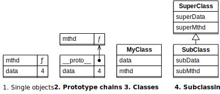
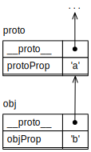
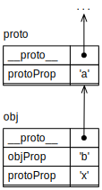
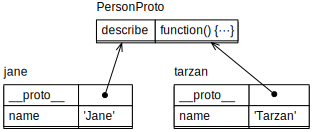
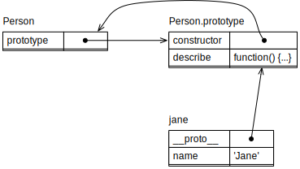
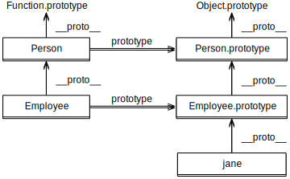
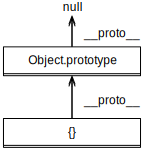
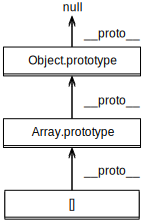
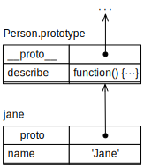

## 26 原型链和类

> 原文： [http://exploringjs.com/impatient-js/ch_proto-chains-classes.html](http://exploringjs.com/impatient-js/ch_proto-chains-classes.html)
> 
> 贡献者：[lq920320](https://github.com/lq920320)

在本书中，JavaScript 的面向对象编程（OOP）风格分四步介绍。本章包括步骤 2-4，[前一章](/docs/31.md)涵盖步骤 1。全部步骤为（图 [9](#fig:oop_steps2) ）所示：

1. 单个对象：*对象*（JavaScript 的基本 OOP 构建块）如何独立工作？
2. **原型链：** 每个对象都有一个零个或多个 *原型对象链*。原型是 JavaScript 的核心继承机制。
3. **类：** JavaScript 的 *类* 是对象的工厂。类及其实例之间的关系基于原型继承。
4. **子类化：** *子类* 与其 *父类* 之间的关系也是基于原型继承。



图 9：此书将会用四个步骤介绍 JavaScript 中的面向对象编程 

### 26.1 原型链

原型是 JavaScript 唯一的继承机制：每个对象都有一个原型，它是 `null` 或一个对象。在后一种情况下，对象继承了所有原型的属性。

在对象字面值中，您可以通过特殊属性 `__proto__` 设置原型：

```js
const proto = {
  protoProp: 'a',
};
const obj = {
  __proto__: proto,
  objProp: 'b',
};

// obj 继承 .protoProp:
assert.equal(obj.protoProp, 'a');
assert.equal('protoProp' in obj, true);
```

鉴于原型对象本身可以拥有原型，我们得到了一系列对象——即所谓*原型链*。这意味着继承给我们的感觉是我们正在处理单个对象，但实际上我们处理的是对象链。

图 [10](#fig:oo_proto_chain) 展示了`obj`的原型链是什么样的。



图 10: 对象链以 `obj` 为始，继而后续的 `proto` 以及其他对象

非继承属性称为*自身属性*。 `obj`有一个自身属性`.objProp`。

#### 26.1.1 JavaScript的操作：所有属性 vs. 自身属性

有的操作会涉及到所有属性（自身和继承的）。例如，获取属性：

```js
> const obj = { foo: 1 };
> typeof obj.foo // 自身属性
'number'
> typeof obj.toString  // 继承属性
'function'
```

另外一些操作则只会涉及其自身属性。例如，`Object.key()`：

```js
> Object.keys(obj)
[ 'foo' ]
```
继续阅读另一个仅考虑自身属性的操作：设置属性。

#### 26.1.2 陷阱：只有原型链的第一个成员发生了变异

可能反直觉的原型链的一个方面是，可以通过对象设置*任何*属性——即使是继承的——仅改变该对象——而从不是原型中的某一属性。

看一下如下对象 `obj`：

```js
const proto = {
  protoProp: 'a',
};
const obj = {
  __proto__: proto,
  objProp: 'b',
};
```

在下一个代码片段中，我们设置了继承属性 `obj.protoProp` （行A）。我们通过创建一个自身属性来“改变”它：当读取 `obj.protoProp` 时，首先要找到自身属性，然后，它的值将覆盖继承属性的值。

```js
// 最开始，obj 有一个自身属性
assert.deepEqual(Object.keys(obj), ['objProp']);

obj.protoProp = 'x'; // (A)

// 我们创建了一个新的自身属性：
assert.deepEqual(Object.keys(obj), ['objProp', 'protoProp']);

// 继承属性自身没有改变：
assert.equal(proto.protoProp, 'a');

// 自身属性覆盖继承属性：
assert.equal(obj.protoProp, 'x');
```

`obj`的原型链如图 11 所示。 [11](#fig:oo_overriding) 。



图 11:`obj`的自身属性 `.protoProp` 覆盖了从 `proto` 继承来的属性。

#### 26.1.3 使用原型的提示（高级）

##### 26.1.3.1 避免`__proto__`（除了对象字面值）

我建议避免使用伪属性 `__proto__`：正如我们稍后将看到的，并非所有的对象都有这一属性。

但是，对象字面值中的 `__proto__` 是不同的，其中，它是一个内置函数，始终可用。

获取和设置原型的推荐方法是：

- 获取原型的最佳方法是通过以下方法：
    ```js
    Object.getPrototypeOf(obj: Object) : Object
    ```

- 设置原型的最佳方法是创建对象——通过对象字面值中的__proto__或通过：
    ```js
    Object.create(proto: Object) : Object
    ```

    如果必须，你可以使用 `Object.setPrototypeOf()` 来更改现有对象的原型。但这可能会对性能产生负面影响。

以下是这些功能的使用方法：

```js
const proto1 = {};
const proto2 = {};

const obj = Object.create(proto1);
assert.equal(Object.getPrototypeOf(obj), proto1);

Object.setPrototypeOf(obj, proto2);
assert.equal(Object.getPrototypeOf(obj), proto2);
```

##### 26.1.3.2 检查：对象是另一个的原型吗？

到目前为止，“p是o的原型”总是意味着“p是o的直接原型”。 但它也可以更松散地使用，并且意味着p在o的原型链中。 可以通过以下方式检查较弱的关系：

```js
p.isPrototypeOf(o)
```

例如：

```js
const a = {};
const b = {__proto__: a};
const c = {__proto__: b};

assert.equal(a.isPrototypeOf(b), true);
assert.equal(a.isPrototypeOf(c), true);

assert.equal(a.isPrototypeOf(a), false);
assert.equal(c.isPrototypeOf(a), false);
```

#### 26.1.4 通过原型共享数据

请参看以下代码：

```js
const jane = {
  name: 'Jane',
  describe() {
    return 'Person named ' + this.name;
  },
};
const tarzan = {
  name: 'Tarzan',
  describe() {
    return 'Person named ' + this.name;
  },
};

assert.equal(jane.describe(), 'Person named Jane');
assert.equal(tarzan.describe(), 'Person named Tarzan');
```

我们有两个非常相似的对象。两者都有两个属性，其名称为`.name`和`.describe`。另外，方法`.describe()`是相同的。我们怎样才能避免重复该方法？

我们可以将它移动到一个对象 `PersonProto`，并使该对象成为`jane`和`tarzan`的（共享）原型：

```js
const PersonProto = {
  describe() {
    return 'Person named ' + this.name;
  },
};
const jane = {
  __proto__: PersonProto,
  name: 'Jane',
};
const tarzan = {
  __proto__: PersonProto,
  name: 'Tarzan',
};
```

原型的名称反映出`jane`和`tarzan`都是人类。



图 12: 对象 `jane` 以及 `tarzan` 通过它们相同的原型 `PersonProto` 共享 `.describe()` 方法。

图中的图表 [12](#fig:oo_person_shared) 说明了三个对象是如何连接的：底部的对象现在包含特定于 `jane` 和 `tarzan` 的属性。顶部的对象包含它们之间共享的属性。

当你调用方法 `jane.describe()` 时，`this` 指向该方法调用的接收者，`jane` （在图的左下角）。这就是该方法仍然有效的原因。调用 `tarzan.describe()` 同理。

```js
assert.equal(jane.describe(), 'Person named Jane');
assert.equal(tarzan.describe(), 'Person named Tarzan');
```

### 26.2 类

我们现在准备接受类，这基本上是用于设置原型链的紧凑语法。`JavaScript` 内部，类是不常提及的，而且你在使用的时候也很少看到的东西。对于其他面向对象编程语言的人来说，它们应该会感到熟悉一些。

#### 26.2.1 一个人类的类（class）

我们之前使用过 `jane` 和 `tarzan`，代表人类的单个对象。让我们用 `类声明` 历史实现 `Person` 对象的工厂：

```js
class Person {
  constructor(name) {
    this.name = name;
  }
  describe() {
    return 'Person named ' + this.name;
  }
}
```

现在可以通过 `new Person()` 创建 `jane` 和 `tarzan`：

```js
const jane = new Person('Jane');
assert.equal(jane.name, 'Jane');
assert.equal(jane.describe(), 'Person named Jane');

const tarzan = new Person('Tarzan');
assert.equal(tarzan.name, 'Tarzan');
assert.equal(tarzan.describe(), 'Person named Tarzan');
```

#### 26.2.1.1 类表达式

有两种类定义（定义类的方法）：

- 类声明：在前面的章节我们已经见过。
- 类表达式：接下来我们会看到。

类表达式可以是匿名的并可以进行命名：

```js
// 匿名类表达式
const Person = class { ··· };

// 命名类表达式
const Person = class MyClass { ··· };
```

命名类表达式与[命名函数表达式](/docs/28.md#2322普通功能的名称)的命名方式类似。

以上便是初见 类，我们很快就会探索更多功能，但首先我们需要学习类的内部。

#### 26.2.2 内部的类（高级）

在类的内部有很多事情要做。让我们看一下 `jane` 的图表（图 [13](#fig:oo_person_class) ）。



图 13：类 `Person` 具有属性 `.prototype`，它指向一个对象，该对象是 `Person` 的所有实例的原型。 `jane` 就是这样一个例子。

类`Person`的主要目的是在右侧设置原型链（`jane`，然后是`Person.prototype`）。有趣的是，`Person` 类（`.constructor` 和 `.descript()`）内的两个构造函数都是为 `Person.prototype` 创建了属性，而不是为 `Person`。

这种稍微奇怪的方法的原因是向后兼容性：在类之前，*构造函数*（[普通函数](/docs/28.md#2323普通功能扮演的角色)，通过 `new` 运算符调用）通常用作对象的工厂。类通常是构造函数的更好语法，因此与旧代码保持兼容。这解释了为什么类是函数：

```js
> typeof Person
'function'
```

在本书中，我可以互换地使用术语 *构造函数（函数）* 和 *类*。

`.__proto__` 和 `.prototype` 很容易混淆。希望图 [13](#fig:oo_person_class) 清楚说明了它们的区别：

- `.__proto__` 是用于访问对象原型的伪属性。
- `.prototype` 是一个普通的属性，取决于 `new` 操作符的使用方式，它只是特殊的。这个命名并不理想：`Person.prototype` 没有指向 `Person` 的原型，它指向 `Person` 的所有实例的原型。

##### 26.2.2.1 `Person.prototype.constructor`（高级）

图 13 中有一个细节我们还没有注意到：`Person.prototype.constructor` 指回`Person`：

```js
> Person.prototype.constructor === Person
true
```

由于向后兼容性，此设置也存在。但它也有两个额外的好处。

首先，类的每个实例都继承属性`.constructor`。因此，给定一个实例，你可以通过它创建“类似”对象：

```js
const jane = new Person('Jane');

const cheeta = new jane.constructor('Cheeta');
// cheeta 也是 Person 的一个实例
// (instanceof 操作符稍后解释)
assert.equal(cheeta instanceof Person, true);
```

其次，您可以获取创建给定实例的类的名称：

```js
const tarzan = new Person('Tarzan');

assert.equal(tarzan.constructor.name, 'Person');
```

#### 26.2.3 类定义：原型属性

以下类声明的主体中的所有构造函数都创建了 `Foo.prototype` 的属性。

```js
class Foo {
  constructor(prop) {
    this.prop = prop;
  }
  protoMethod() {
    return 'protoMethod';
  }
  get protoGetter() {
    return 'protoGetter';
  }
}
```

让我们逐个看一下：

- 在创建 `Foo` 的新实例后调用 `.constructor()` 来设置该实例。
- `.protoMethod()` 是一种常规方法。它存储在`Foo.prototype`中。
- `.protoGetter` 是存储在 `Foo.prototype` 中的 getter （获取方法）。

以下交互使用类 `Foo`：

```js
> const foo = new Foo(123);
> foo.prop
123

> foo.protoMethod()
'protoMethod'
> foo.protoGetter
'protoGetter'
```

#### 26.2.4 类定义：静态属性

一下类声明的主体中所有构造函数都创建了所谓的*静态属性*—— `Bar` 的自身属性：

```js
class Bar {
  static staticMethod() {
    return 'staticMethod';
  }
  static get staticGetter() {
    return 'staticGetter';
  }
}
```

静态方法和静态 get 方法使用如下：

```js
> Bar.staticMethod()
'staticMethod'
> Bar.staticGetter
'staticGetter'
```

#### 26.2.5 `instanceof`运算符

`instanceof` 运算符告诉你某个值是否是给定类的实例：

```js
> new Person('Jane') instanceof Person
true
> ({}) instanceof Person
false
> ({}) instanceof Object
true
> [] instanceof Array
true
```

在我们查看子类化之后，我们将在后面更详细地探索 `instanceof` 运算符。

#### 26.2.6 为什么我推荐类

我推荐使用类，原因如下：

- 类是对象创建和继承的通用标准，现在跨框架（React，Angular，Ember 等）广泛支持。这是对以前事物的改进，几乎每个框架都有自己的继承库。
- 他们帮助 IDE 和类型检查器等工具完成工作并启用新功能。
- 如果你是从其他语言来转向JavaScript，并熟悉类，那么你可更快地开始学习。
- JavaScript 引擎会进行优化。也就是说，使用类的代码几乎比使用比使用自定义继承库的代码更快。
- 你可以子类化内置构造函数，例如 `Error`。

这并不意味着类是完美的：

- 存在过度继承的风险。
- 存在在类中放置太多函数细节的风险（当其中某些细节还是放在函数中时更好一些）。
- 他们在表面上和内部的运行过程是完全不同的。 换句话说，语法和语义之间存在脱节。 两个例子是：
  - 一个定义在类 `C` 中的内部方法，在对象 `C.prototype` 中创建了一个方法。
  - 类即函数。

> **练习：实现一个类**
>
> `exercises/proto-chains-classes/point_class_test.js`

### 26.3 类的私有数据

本节描述了从外部隐藏对象的一些数据的技术。我们在类的上下文中讨论它们，但它们也适用于通过对象字面值等直接创建的对象。

#### 26.3.1 私有数据：命名约定

第一种技术通过在其名称前加下划线来使属性成为私有属性。这不会以任何方式保护属性；它只是向外界发出信号：“你不需要知道这个属性。”

在以下代码中，属性 `._counter` 和 `._action` 是私有的。

```js
class Countdown {
  constructor(counter, action) {
    this._counter = counter;
    this._action = action;
  }
  dec() {
    this._counter--;
    if (this._counter === 0) {
      this._action();
    }
  }
}

// 这两个属性并非真正私有：
assert.deepEqual(
  Object.keys(new Countdown()),
  ['_counter', '_action']);
```

使用这种方法，不会得到任何保护，私有命名可能会发生冲突。从好的方面来说，它简单易用。

#### 26.3.2 私人数据：WeakMaps

另一种技术是使用 WeakMaps。在[关于 WeakMaps](/docs/38.md#3132通过-weakmaps-保存私人数据) 的章节中解释了究竟是如何工作的。这里只是预览：

```js
const _counter = new WeakMap();
const _action = new WeakMap();

class Countdown {
  constructor(counter, action) {
    _counter.set(this, counter);
    _action.set(this, action);
  }
  dec() {
    let counter = _counter.get(this);
    counter--;
    _counter.set(this, counter);
    if (counter === 0) {
      _action.get(this)();
    }
  }
}

// 这两个伪属性是真正私有的：
assert.deepEqual(
  Object.keys(new Countdown()),
  []);
```

这种技术为你提供了相当大的外部访问保护，并且不会有任何命名冲突。但使用起来也更复杂。

#### 26.3.3 更多私有数据技术

本书介绍了类中私有数据的最重要技术。JavaScript 可能很快就会内置对私有数据的支持。有关详细信息，请参阅 ECMAScript 提案[“类公共实例字段 ＆ 私有实例字段“](https://github.com/tc39/proposal-class-fields)


[“探索ES6”](https://exploringjs.com/es6/ch_classes.html#sec_private-data-for-classes)中介绍了一些其他技术。

### 26.4 子类

类也可以子类化（“扩展”）现有类。例如，以下类 `Person` 的子类 `Employee`：

```js
class Person {
  constructor(name) {
    this.name = name;
  }
  describe() {
    return `Person named ${this.name}`;
  }
  static logNames(persons) {
    for (const person of persons) {
      console.log(person.name);
    }
  }
}

class Employee extends Person {
  constructor(name, title) {
    super(name);
    this.title = title;
  }
  describe() {
    return super.describe() +
      ` (${this.title})`;
  }
}

const jane = new Employee('Jane', 'CTO');
assert.equal(
  jane.describe(),
  'Person named Jane (CTO)');
```

注解两条：

- 在 `.constructor()` 方法中，必须先通过 `super()` 调用父类构造函数，然后才能访问 `this`。那是因为在调用父类构造函数之前 `this` 不存在（这种现象特定于类）。
- 静态方法也是继承的。例如，`Employee` 继承静态方法 `.logNames()`：
    ```js
    > 'logNames' in Employee
    true
    ```

>  **练习：子类化**
>
> `exercises/proto-chains-classes/color_point_class_test.js`

#### 26.4.1 内部的子类（高级）



图 14: 这些是构成类 `Person` 它的子类 `Employee` 的对象。左边是关于类的，右边是关于 `Employee` 实例 `jane` 及其原型链。

上一节中的`Person`和`Employee`类由几个对象组成（图 [14](#fig:oo_subclassing) ）。理解这些对象如何相关的一个关键见解是，有两个原型链：

- 实例原型链，在右侧。
- 类原型链，在左边。

##### 26.4.1.1 实例原型链（右栏）

实例原型链以 `jane` 开始，接着是 `Employee.prototype` 和 `Person.prototype`。原则上，虽然原型链在此时结束，但我们还得到一个对象：`Object.prototype`。这个原型为几乎所有对象提供服务，这也是为什么它包含在这里：

```js
> Object.getPrototypeOf(Person.prototype) === Object.prototype
true
```

##### 26.4.1.2 类原型链（左栏）

在类原型链中，`Employee` 首先出现，接下来是 `Person`。之后，链只接着连至 `Function.prototype`，因为`Person`是一个函数，函数需要`Function.prototype`的服务。

```js
> Object.getPrototypeOf(Person) === Function.prototype
true
```

#### 26.4.2 `instanceof`的详细内容（高级）

我们还没有看到`instanceof`如何真正起作用。给定表达式：
```js
x instanceof C
```
`instanceof`如何确定`x`是否是`C`的实例？它通过检查`C.prototype`是否在`x`的原型链中来实现。也就是说，以下两个表达式是等效的：

```js
x instanceof C
C.prototype.isPrototypeOf(x)
```

如果我们回到图。 [14](#fig:oo_subclassing) ，我们可以确认原型链确实引导我们得到以下答案：

```js
> jane instanceof Employee
true
> jane instanceof Person
true
> jane instanceof Object
true
```

#### 26.4.3 内置对象的原型链（高级）

接下来，我们将使用我们的子类化知识来理解一些内置对象的原型链。以下工具功能 `p()` 帮助我们进行探索。

```js
const p = Object.getPrototypeOf.bind(Object);
```

我们提取 `Object` 的方法 `.getPrototypeOf()` 并将其分配给 `p`。

##### 26.4.3.1  `{}`的原型链

让我们从检查普通对象开始：

```js
> p({}) === Object.prototype
true
> p(p({})) === null
true
```



图 15: 通过对象值创建的对象的原型链由该对象开始，接着是 `Object.prototype`，最后以 `null` 结束

图 [15](#fig:proto_chain_object) 显示了该原型链的图表。我们可以看到`{}`确实是`Object`的实例 - `Object.prototype`在其原型链中。

##### 26.4.3.2 `[]`的原型链

Array 的原型链是什么样的？

```js
> p([]) === Array.prototype
true
> p(p([])) === Object.prototype
true
> p(p(p([]))) === null
true
```



图 16： 一个数组的原型链有几个部分组成: 数组实例， `Array.prototype`， `Object.prototype`， `null`。

这个原型链（在图 [16](#fig:proto_chain_array) 中可视化）告诉我们一个 Array 对象是`Array`的一个实例，它是`Object`的子类。

##### 26.4.3.3 `function () {}`的原型链

最后，普通函数的原型链告诉我们所有函数都是对象：

```js
> p(function () {}) === Function.prototype
true
> p(p(function () {})) === Object.prototype
true
```

##### 26.4.3.4 不是`Object`实例的对象

如果 `Object.prototype` 在其原型链中，则对象只是 `Object` 的实例。通过各种字面值创建的大多数对象是 `Object` 的实例：

```js
> ({}) instanceof Object
true
> (() => {}) instanceof Object
true
> /abc/ug instanceof Object
true
```

没有原型的对象不是 `Object` 的实例：

```js
> ({ __proto__: null }) instanceof Object
false
```

`Object.prototype` 结束了大多数原型链。它的原型是`null`，这意味着它也不是 `Object` 的实例：

```js
> Object.prototype instanceof Object
false
```

##### 26.4.3.5 伪属性.__ proto__究竟是如何工作的？

伪属性.__ proto__由类Object通过getter和setter实现。可以像这样实现：

```js
class Object {
  get __proto__() {
    return Object.getPrototypeOf(this);
  }
  set __proto__(other) {
    Object.setPrototypeOf(this, other);
  }
  // ···
}
```

这意味着您可以通过在其原型链中创建一个没有`Object.prototype`的对象来关闭 `.__ proto__`（参见上一节）:

```js
> '__proto__' in {}
true
> '__proto__' in { __proto__: null }
false
```

#### 26.4.4 调度调用 vs 直接方法调用（高级）

让我们来看一下方法调用如何与类一起工作。我们从再次访问之前的 `jane` ：

```js
class Person {
  constructor(name) {
    this.name = name;
  }
  describe() {
    return 'Person named ' + this.name;
  }
}
const jane = new Person('Jane');
```

图 [17](#fig:jane_proto_chain) 有一个带有`jane`原型链的图表。



图 17: `jane` 的原型链由 `jane` 开始接着是 `Person.prototype`。

正常方法调用是*调度式的*，`jane.describe()` 这一方法调用发生在两步：

- 调度：在 `jane` 的原型链中，找到其键为'describe'的第一个属性并检索其值。
  ```js
  const func = jane.describe;
  ```
- 调用：调用找到的值，同时将`this`设置为`jane`。
  ```js
  func.call(jane);
  ```

这种动态查找方法的方式称为*动态调度*。

你可以在绕过这种调度进行相同方法的直接调用：

```js
Person.prototype.describe.call(jane)
```

这次，我们通过`Person.prototype.describe`直接指向了方法，且没有在原型链中进行搜索。我们还通过 `.call()` 以不同的方式进行了指定。

注意 `this` 总是指向原型链的开头。这使得 `.describe()` 能够访问 `.name`。

##### 26.4.4.1 借用方法

使用 `Object.prototype` 的方法时，直接方法调用很有用。例如，`Object.prototype.hasOwnProperty(k)` 检查 `this` 对象是否具有其键为 `k` 的非继承属性：

```js
> const obj = { foo: 123 };
> obj.hasOwnProperty('foo')
true
> obj.hasOwnProperty('bar')
false
```

但是，在一个对象的原型链中，可能会有另外一个属性为 `hasOwnProperty` 的键，那会覆盖掉在 `Object.prototype` 中的同名方法。然后调度的方法调用便不起作用：

```js
> const obj = { hasOwnProperty: true };
> obj.hasOwnProperty('bar')
TypeError: obj.hasOwnProperty is not a function
```

解决方法是使用直接方法调用：

```js
> Object.prototype.hasOwnProperty.call(obj, 'bar')
false
> Object.prototype.hasOwnProperty.call(obj, 'hasOwnProperty')
true
```

这种直接方法调用通常缩写如下：

```js
> ({}).hasOwnProperty.call(obj, 'bar')
false
> ({}).hasOwnProperty.call(obj, 'hasOwnProperty')
true
```

这种模式似乎效率低下，但是大部分（JavaScript）引擎优化了这种模式，因此性能上不成问题。

#### 26.4.5 混入类（Mixin Classes）（高级）

JavaScript 的类系统仅支持*单继承*。也就是说，每个类最多只能有一个父类。绕过这种限制的方法是通过称为 *mixin 类*（简称： *mixins* ）的技术。

这个想法如下：让我们假设有一个类 `C` 想要继承于两个父类 `S1` 和 `S2`。这样就会是多继承，JavaScript 并不支持。

我们的解决方法便是把 `S1` 和 `S2` 转成 `mixins`，即子类的工厂：

```js
const S1 = (Sup) => class extends Sup { /*···*/ };
const S2 = (Sup) => class extends Sup { /*···*/ };
```

这两个函数中的每一个都返回一个继承给定父类 `Sup` 的类。 我们创建C类如下：

```js
class C extends S2(S1(Object)) {
  /*···*/
}
```

我们现在有一个类C，它继承了一个类 S2，S2 继承了一个继承了 Object 的类 S1（大多数类都是隐含的）。

##### 26.4.5.1 示例：用于品牌管理的混入

我们实现一个混入类 `Branded`，它具有帮助方法来设置和获取对象的品牌：

```js
const Branded = (Sup) => class extends Sup {
  setBrand(brand) {
    this._brand = brand;
    return this;
  }
  getBrand() {
    return this._brand;
  }
};
```

我们使用这个mixin来实现类 `Car` 的品牌管理：

```js
class Car extends Branded(Object) {
  constructor(model) {
    super();
    this._model = model;
  }
  toString() {
    return `${this.getBrand()} ${this._model}`;
  }
}
```

以下代码确认 mixin 有效：`Car` 具有 `Branded` 的方法 `.setBrand()`。

```js
const modelT = new Car('Model T').setBrand('Ford');
assert.equal(modelT.toString(), 'Ford Model T');
```

##### 26.4.5.2 混入类（mixins）的好处

Mixins 让我们摆脱单一继承的束缚：

- 同一个类可以继承单个父类和零个或多个 mixin。

- 多个类可以使用相同的mixin。

### 26.5 FAQ: 对象

#### 26.5.1 为什么对象保留属性的插入顺序？

原则上，对象是无序的。排序属性的主要原因是列出条目，键或值的操作是确定性的。这有助于，比如，测试。

>  **测验**
>
> 参见[测验应用程序](/docs/11.md#91测验)。