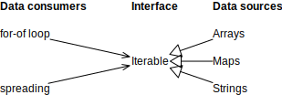
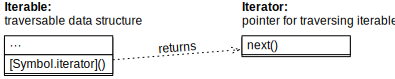

## 27 同步迭代

> 原文： [http://exploringjs.com/impatient-js/ch_sync-iteration.html](http://exploringjs.com/impatient-js/ch_sync-iteration.html)

### 27.1 什么是同步迭代？

同步迭代是一个 *协议*（接口加上使用它们的规则），它连接 JavaScript 中的两组实体：

- **数据来源：** 一方面，数据有各种形式和大小。在 JavaScript 的标准库中，有线性数据结构 Array，有序集合 Set（元素按添加时间排序），有序字典 Map（条目按添加时间排序）等等。在库中，您还可以找到树形数据结构等。

- **数据消费者：** 另一方面，你有一整套机制和算法，只需要按顺序访问：一次一个，再加上告诉我什么时候完成的方法。示例包括`for-of`循环并扩展到数组字面值（通过`...`）。

迭代协议通过接口`Iterable`连接这两部分：数据源按顺序“穿过它”传递它们的内容；数据消费者通过它获得输入。



Figure 18: Data consumers such as the `for-of` loop use the interface `Iterable`. Data sources such as `Arrays` implement that interface.

图中的图表 [18](#fig:iterable-implementers-clients) 说明了迭代的工作原理：数据消费者使用接口`Iterable`；数据源实现它。

> **JavaScript 实现接口的方式**
>
> 在 JavaScript 中，如果一个对象具有接口声明的所有方法，即为 *实现* 该接口。本章中提到的接口仅存在于ECMAScript规范中。

数据的来源和消费者都从这种安排中获益：

*   如果您开发新的数据结构，则只需要实现`Iterable`，就可以立即应用大量工具。

*   如果编写使用迭代的代码，它会自动使用许多数据源。

### 27.2 核心迭代构造：迭代接口和迭代器

两个角色（由接口描述）构成了迭代的核心（图 [19](#fig:iteration-protocol) ）：

*   *iterable* 接口是一个对象，其内容可以顺序遍历。
*   *迭代器* 是用于遍历的指针。



Figure 19: 迭代有两个主要的接口: `Iterable` 和 `Iterator`。前者有一种返回后者的方法。

这些是迭代协议接口的类型定义（以 TypeScript 的表示法）：

```js
interface Iterable<T> {
  [Symbol.iterator]() : Iterator<T>;
}

interface Iterator<T> {
  next() : IteratorResult<T>;
}

interface IteratorResult<T> {
  value: T;
  done: boolean;
}
```

接口使用如下：

*   您可以通过键为 `Symbol.iterator` 的方法向 `Iterable` 接口请求迭代器。
*   `Iterator` 通过其方法 `.next()` 返回迭代值。
*   这些值不会直接返回，而是包含在具有两个属性的对象中：
    * `.value` 是迭代值。
    * `.done` 表示是否已达到迭代结束。在最后一次迭代值和 `false` 之后是`true`。

### 27.3 手动迭代

这是使用迭代协议的示例：

```js
const iterable = ['a', 'b'];

// The iterable is a factory for iterators:
const iterator = iterable[Symbol.iterator]();

// Call .next() until .done is true:
assert.deepEqual(
  iterator.next(), { value: 'a', done: false });
assert.deepEqual(
  iterator.next(), { value: 'b', done: false });
assert.deepEqual(
  iterator.next(), { value: undefined, done: true });
```

#### 27.3.1 通过`while`迭代一个迭代（Iterable）

以下代码演示了如何使用`while`循环迭代一个迭代：

```js
function logAll(iterable) {
  const iterator = iterable[Symbol.iterator]();
  while (true) {
    const {value, done} = iterator.next();
    if (done) break;
    console.log(value);
  }
}

logAll(['a', 'b']);
// Output:
// 'a'
// 'b'
```

>  **练习：手动使用同步迭代**
>
> `exercises/sync-iteration-use/sync_iteration_manually_exrc.mjs`

### 27.4 实践中的迭代

我们已经看到了如何手动使用迭代协议，这是相对麻烦的。但该协议并不是直接使用的——它旨在通过构建在其上的更高级语言结构来使用。本节介绍了它看起来是什么样的。

#### 27.4.1 迭代数组（Array）

JavaScript 的数组是可迭代的。这使我们可以使用`for-of`循环：

```js
const myArray = ['a', 'b', 'c'];

for (const x of myArray) {
  console.log(x);
}
// Output:
// 'a'
// 'b'
// 'c'
```

通过数组模式进行解构（稍后解释）也使用了迭代：

```js
const [first, second] = myArray;
assert.equal(first, 'a');
assert.equal(second, 'b');
```

#### 27.4.2 迭代 Set 

JavaScript 的 Set 数据结构是可迭代的。这意味着，`for-of`有效：

```js
const mySet = new Set().add('a').add('b').add('c');

for (const x of mySet) {
  console.log(x);
}
// Output:
// 'a'
// 'b'
// 'c'
```

和数组解构一样：

```js
const [first, second] = mySet;
assert.equal(first, 'a');
assert.equal(second, 'b');
```

### 27.5 快速参考：同步迭代

#### 27.5.1 可迭代数据源

以下内置数据源是可迭代的：

*   `Arrays`
*   `Strings`
*   `Maps`
*   `Sets`
*   （浏览器：DOM 数据结构）

要迭代对象的属性，你需要一些“帮手”，诸如 `Object.keys()` 和 `Object.entries()` 。这很必要，因为属性存在于与数据结构级别互补的不同级别。

#### 27.5.2 迭代结构

以下构造都基于迭代：

*   通过数组模式进行解构：

    ```js
    const [x,y] = iterable;
    ```

*   `for-of`循环：

    ```js
    for (const x of iterable) { /*···*/ }
    ```

*   `Array.from()`：

    ```js
    const arr = Array.from(iterable);
    ```

*   将（通过`...`）传播到数组和函数调用中：

    ```js
    const arr = [...iterable];
    func(...iterable);
    ```

*   `new Map()`和`new Set()`：

    ```js
    const m = new Map(iterableOverKeyValuePairs);
    const s = new Set(iterableOverElements);
    ```

*   `Promise.all()`和`Promise.race()`：

    ```js
    const promise1 = Promise.all(iterableOverPromises);
    const promise2 = Promise.race(iterableOverPromises);
    ```

*   `yield*`：

    ```js
    function* generatorFunction() {
      yield* iterable;
    }
    ```

>  **测验**
> 
> 参见[测验应用程序](/docs/11.md#91测验)。