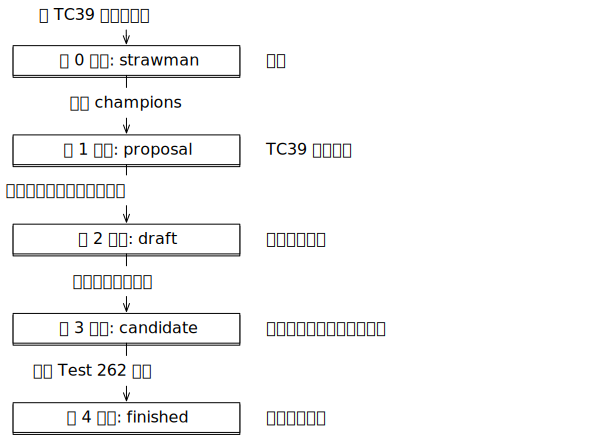

## 3\. JavaScript 的历史和演变

> 原文： [http://exploringjs.com/impatient-js/ch_history.html](http://exploringjs.com/impatient-js/ch_history.html)

### 3.1 JavaScript 是如何诞生的

JavaScript 由 Brendan Eich 于 1995 年 5 月创建，工期 10 天。 Eich 在 Netscape 工作并为它的网络浏览器 _Netscape Navigator_ 实现了 JavaScript。

当时，人们认为 Web 客户端的主要交互部分将用 Java 实现。 JavaScript 应该是这些部分的粘合语言，并且可以使 HTML 更具交互性。鉴于它在协助 Java 方面的作用，JavaScript 必须看起来像 Java。这排除了现有的解决方案，如 Perl，Python，TCL 等。

最初，JavaScript 的名称改变了数次：

*   它的代号是 _Mocha_ 。
*   在 Netscape Navigator 2.0 测试版（1995 年 9 月）中，它被称为 _LiveScript_ 。
*   在 Netscape Navigator 2.0 beta 3（1995 年 12 月）中，它的最终名称为 _JavaScript_ 。

### 3.2 标准化

JavaScript 有两个标准：

*   ECMA-262 由 Ecma International 主持。这是主要标准。
*   ISO / IEC 16262 由国际标准化组织（ISO）和国际电工委员会（IEC）主持。这是次要标准。

这些标准描述的语言称为 _ECMAScript_ ，而不是 _JavaScript_ 。使用不同的名称，是因为 Sun（现在的 Oracle）拥有“Java”的商标。“ECMAScript”中的“ECMA”来自主持主要标准的组织。

该组织的原始名称是 _ECMA_ ，_欧洲计算机制造商协会_ 的首字母缩写。后来它改名成了 _Ecma International_ （“Ecma”是一个专有名称，而不是缩写），因为该组织的活动已经扩展到欧洲以外。ECMAScript 的拼写仍然使用全大写的缩写。

原则上，JavaScript 和 ECMAScript 是同一个东西。但有时，会做出以下区分：

*   术语 _JavaScript_ 指的是语言及其实现。
*   术语 _ECMAScript_ 是指语言标准和语言版本。

因此， _ECMAScript 6_ 是该语言的一个版本（其第 6 版）。

### 3.3 ECMAScript 版本的时间表

这是 ECMAScript 版本的简要时间表：

*   ECMAScript 1（1997 年 6 月）：该标准的第一版。
*   ECMAScript 2（1998 年 6 月）：小更新，使 ECMA-262 与 ISO 标准保持同步。
*   ECMAScript 3（1999 年 12 月）：添加了许多核心功能——“[...]正则表达式，更好的字符串处理，新的控制语句[do-while，switch]，try / catch 异常处理，[...]”
*   ECMAScript 4（2008 年 7 月放弃）：本来是一次大规模的升级（使用静态类型，模块，命名空间等），但最终变得过于激进并且导致了阵营分歧。因此，它被放弃了。
*   ECMAScript 5（2009 年 12 月）：带来了一些小改进——一些标准库功能和 [_严格模式_](ch_syntax.html#strict-mode) 。
*   ECMAScript 5.1（2011 年 6 月）：另一项保持 Ecma 和 ISO 标准同步的小更新。
*   ECMAScript 6（2015 年 6 月）：一个大型更新，履行了 ECMAScript 4 的许多承诺。这个版本的正式名称是 _ECMAScript 2015_，它是首个基于发布年份的名称。
*   ECMAScript 2016（2016 年 6 月）：第一次年度发布。与 ES6 的全面更新相比，较短的发布生命周期导致新功能较少。
*   ECMAScript 2017（2017 年 6 月）。第二次年度发布。
*   随后的 ECMAScript 版本（ES2018 等）始终会在 6 月份获得批准。

### 3.4 Ecma 技术委员会 39（TC39）

TC39 是发展 JavaScript 的委员会。严格来说，它的成员都是公司：Adobe，Apple，Facebook，Google，Microsoft，Mozilla，Opera，Twitter 等。这些公司通常是激烈的竞争对手，但它们正在为语言的利益而共同努力。

每两个月，成员任命的代表和受邀专家会参加 TC39 会议。这些会议的记录是公开的，可以在 [GitHub 仓库](https://github.com/tc39/tc39-notes/)中看到。

### 3.5 TC39 流程

通过 ECMAScript 6，我们可以看到当时的发布过程存在两个明显的问题：

*   如果在版本之间隔了太长时间，那么早期准备好的功能必须等待很长时间才能发布，并且没有准备好的功能可能会赶不上死线。
*   功能通常在实现和使用之前很久就已设计好。因此，当发现与实现和使用相关的设计缺陷时，通常为时已晚。

针对这些问题，TC39 制定了新的 _TC39 流程_：

*   ECMAScript 功能是分别独立设计的，而且会经历 5 个阶段，从 0 开始（“Strawman”），结束于 4（“Finished”）。
*   后期的几个阶段需要原型实现和实际测试，从而获得设计和实现之间的有效交互。
*   ECMAScript 版本每年发布一次，将会包括在发布截止日期之前已达到第 4 阶段的所有功能。

因此，我们可以获得：每个版本变动较小，带有经过实际测试的特性。图 [1](#fig:tc39-process-stages) 说明了 TC39 过程。

图 1：每个 ECMAScript 特性的提案会经过从 0 到 4 依次编号的 5 个阶段。_Champions_ 是指支持某个特性提案的 TC39 成员。 Test 262 是一套测试，用于检测 JavaScript 引擎是否正确实现了语言标准。

ES2016 是第一个根据 TC39 流程设计的 ECMAScript 版本。

有关 TC39 过程的更多信息，请参阅[“探索 ES2018 和 ES2019”](es2018-es2019/ch_tc39-process.html)。

#### 3.5.1 提示：让你的思路适应独立的功能和阶段，而不是一整个 ECMAScript 版本

在 ES6 之前，最常见的想法是根据 ECMAScript 版本来考虑 JavaScript。例如：“这个浏览器是否支持 ES6？”

从 ES2016 开始，最好开始考虑单个功能：一旦功能到达第 4 阶段，你就可以安全地使用它（只要它被你所使用的 JavaScript 引擎所支持），而不必等到下一个 ECMAScript 版本发布。

### 3.6 常见问题：关于 TC39 流程

#### 3.6.1 [填入你最喜欢的功能]进展怎么样？

如果您想了解每个特性草案处于什么阶段，请参考 [GitHub 仓库 `tc39/proposals`](https://github.com/tc39/proposals) 。

#### 3.6.2 是否有正式的 ECMAScript 特性列表？

是的，TC39 的仓库里列出了[已经完成的提案](https://github.com/tc39/proposals/blob/master/finished-proposals.md)，并提到了它们在哪个 ECMAScript 版本被引入。

### 3.7 JavaScript 进化哲学：不要破坏（特性）网络

经常出现的一个想法是通过删除旧功能和各种坑来清理 JavaScript。虽然这个想法很有吸引力，但它也有明显的缺点。

假设我们创建了一个不向后兼容的 JavaScript 新版本并修复了它的所有缺陷。结果，我们遇到了以下问题：

*   JavaScript 引擎变得臃肿：它们需要支持旧版本和新版本。对于诸如 IDE 和构建工具之类的工具也是如此。
*   程序员需要知道并不断注意版本之间的差异。
*   你要么将所有现有代码库迁移到新版本（这可能需要大量工作），要么混合两种版本，让重构变得更难——因为你无法在不改代码的情况下在版本之间共用代码。
*   你不得不指定每段代码是用什么版本编写的，无论是嵌入在网页中的代码还是单独的文件。每个可想到的解决方案都有利有弊。例如， [_严格模式_](ch_syntax.html#strict-mode) 是 ES5 的稍微改进的版本。它之所以不那么流行的原因之一是：在文件或函数的开头通过加入指令来启用功能是一件麻烦事。

那么解决方案是什么？我们能达到我们的目标吗？ES6 选择的方法称为“One JavaScript”：

*   新版本总是完全向后兼容（但偶尔可能会有轻微的，几乎不可察觉的清理）。
*   旧功能不会被删除或修复。相反，会有一个更好的功能作为替代。一个例子是通过 `let` 声明变量——这是 `var` 的改进版本。
*   如果语言本身的某些方面发生了变化，那么这个变化只会在某个新的语法环境里应用。也就是说，你不需要做任何特定的声明。例如，`yield` 只是生成器内部的关键字（它在 ES6 中被引入）；而模块和类中的所有代码（它们都在 ES6 中引入）隐式地处于严格模式。

有关 One JavaScript 的更多信息，请参阅[“探索 ES6”](es6/ch_one-javascript.html)。

 **测验**

参见[测验应用程序](ch_quizzes-exercises.html#quizzes)。
