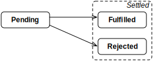

## 37.异步编程的 Promise

> 原文： [http://exploringjs.com/impatient-js/ch_promises.html](http://exploringjs.com/impatient-js/ch_promises.html)
> 
> 贡献者：[iChrisJ](https://github.com/iChrisJ)

在本章中，我们将探索 Promise，另一种交付异步结果的模式。

本章建立在[前一章](ch_async-js.html)的基础上，以JavaScript异步编程为背景。

### 37.1. 使用 Promise 的基础知识

Promise 是一种交付异步结果的模式。

#### 37.1.1. 使用基于 Promise 的函数

以下代码是使用基于 Promise 的函数`addAsync()`的示例（其实现将很快会被展示）：

```JavaScript
addAsync(3, 4)
  .then(result => { // success
    assert.equal(result, 7);
  })
  .catch(error => { // failure
    assert.fail(error);
  });
```

Promise 结合了[回调模式](ch_async-js.html#callback-pattern)和[事件模式](ch_async-js.html#event-pattern)的各个方面：

* 与回调模式一样，Promise 专注于提供一次性结果。

* 与某些事件模式类似，一个基于 Promise 的函数通过返回一个对象（ _Promise_ ）来传递其结果。使用该对象，你可以注册处理结果（`.then()`）和错误（`.catch()`）的回调。

* Promise 的一个独特之处在于你可以串联`.then()`和`.catch()`，因为它们都返回 Promise。这有助于顺序调用多个异步函数。我们稍后将探讨其详情。

#### 37.1.2. 什么是 Promise？

那么什么是 Promise？有两种方式来看待它：

* 一方面，它是最终要被交付结果的一个占位符或容器。
* 另一方面，它是一个可以注册监听器的对象。

#### 37.1.3. 实现基于 Promise 的函数

这是你如何实现一个基于 Promise 的关于两个数字`x`和`y`相加的函数：

```JavaScript
function addAsync(x, y) {
  return new Promise(
    (resolve, reject) => { // (A)
      if (x === undefined || y === undefined) {
        reject(new Error('Must provide two parameters'));
      } else {
        resolve(x + y);
      }
    });
}
```

使用这种返回 Promise 的方式，`addAsync()`立即调用`Promise`构造函数。该函数的实际实现存在于传递给该构造函数的回调中（行 A）。该回调被提供了两个方法：

* `resolve`用于传递结果（如果成功）。
* `reject`用于传递错误（如果失败）。

#### 37.1.4. Promise 的状态



图 21: 一个 Promise 可以处于三种状态中的任何一种: pending（待定）, fulfilled(已履行), 或 rejected（被拒绝）. 如果一个 Promise 处于最终 (non-pending 非待定) 状态, 则称为 _settled（已结算）_ .


图 [21](#fig:promise_states_simple) 描述了 Promise 可以进入的三种状态. Promise 专注于一次性结果并保护您免受 _竞态条件_（过早注册或太晚注册）：

* 如果您过早注册`.then()`回调或`.catch()`回调，则会在 Promise 结算后被通知。
* 一旦一个 Promise 被结算了，其结算值（结果或错误）会被缓存。因此，如果在结算后调用`.then()`或`.catch()`，它们将收到被缓存的值。

此外，一旦 Promise 得到结算，其状态和结算值就不能再改变了。这有助于使代码变得可预测，并加强了 Promise 的一次性特性。

接下来，我们将看到更多创建 Promise 的方法。

#### 37.1.5. `Promise.resolve()`：创建一个被给定值履行的 Promise

`Promise.resolve(x)`创建一个使用值`x`实现的 Promise：

```JavaScript
Promise.resolve(123)
.then(x => {
  assert.equal(x, 123);
});
```

如果参数已经是一个 Promise，则返回是不变：

```JavaScript
const abcPromise = Promise.resolve('abc');
assert.equal(
  Promise.resolve(abcPromise),
  abcPromise);
```

因此，给定任意值`x`，您可以使用`Promise.resolve(x)`确保您拥有一个 Promise。

请注意，函数名称是`resolve`，而不是`fulfill`，因为如果参数是一个被拒绝的 Promise，`.resolve()`会返回被拒绝的 Promise。

#### 37.1.6. `Promise.reject()`：创建一个被给定值拒绝的 Promise

`Promise.reject(err)`创建一个使用值`err`实现的 Promise：

```JavaScript
const myError = new Error('My error!');
Promise.reject(myError)
.catch(err => {
  assert.equal(err, myError);
});
```

#### 37.1.7. 在`.then()`回调中返回或抛出

`.then()`处理 Promise 的履行。它返回一个新鲜的 Promise。这个 Promise 是如何达成的取决于回调中发生了什么。我们来看看三种常见情况。

##### 37.1.7.1. 返回一个非 Promise 值

首先，回调可以返回一个非 Promise 值（行 A）。因此，`.then()`返回的 Promise 满足该值（如 B 行所示）：

```JavaScript
Promise.resolve('abc')
.then(str => {
  return str + str; // (A)
})
.then(str2 => {
  assert.equal(str2, 'abcabc'); // (B)
});
```

##### 37.1.7.2. 返回一个 Promise

其次，回调可以返回一个 Promise `p`（行 A）。因此，`p`“成为”`.then()`返回的内容（`.then()`已经返回的 Promise 实际上被`p`替换）。

```JavaScript
Promise.resolve('abc')
.then(str => {
  return Promise.resolve(123); // (A)
})
.then(num => {
  assert.equal(num, 123);
});
```

##### 37.1.7.3. 抛出异常

第三，回调可以抛出异常。因此，`.then()`返回的 Promise 被该异常拒绝。也就是说，同步错误被转换为异步错误。

```JavaScript
const myError = new Error('My error!');
Promise.resolve('abc')
.then(str => {
  throw myError;
})
.catch(err => {
  assert.equal(err, myError);
});
```

#### 37.1.8. `.catch()`及其回调

`.then()`和`.catch()`之间的唯一区别是后者是由拒绝而不是履行触发的。但是，这两种方法都以相同的方式将其回调的操作转换为 Promise。例如，在以下代码中，行 A 中`.catch()`回调返回的值将成为履行值：

```JavaScript
const err = new Error();

Promise.reject(err)
.catch(e => {
  assert.equal(e, err);
  // Something went wrong, use a default value
  return 'default value'; // (A)
})
.then(str => {
  assert.equal(str, 'default value');
});
```

#### 37.1.9. 串联方法调用

由于`.then()`和`.catch()`总是返回 Promise，您可以创建任意长度的方法调用链：

```JavaScript
function myAsyncFunc() {
  return asyncFunc1()
  .then(result1 => {
    // ···
    return asyncFunc2(); // a Promise
  })
  .then(result2 => {
    // ···
    return result2 || '(Empty)'; // not a Promise
  })
  .then(result3 => {
    // ···
    return asyncFunc4(); // a Promise
  });
}
```

在某种程度上，`.then()`是同步分号的异步版本：

* `.then()`是按顺序执行两个异步操作。
* 分号是按顺序执行两个同步操作。

您还可以将`.catch()`添加到混合的方法调用链中，并让它同时处理多个错误源：

```JavaScript
asyncFunc1()
.then(result1 => {
  // ···
  return asyncFunction2();
})
.then(result2 => {
  // ···
})
.catch(error => {
  // Failure: handle errors of asyncFunc1(), asyncFunc2()
  // and any (sync) exceptions thrown in previous callbacks
});
```

#### 37.1.10. Promise 的优势

在处理一次性结果时，这些是 Promise 优于普通回调的一些优点：

* 基于 Promise 的函数和方法的类型签名更清晰：如果函数是基于回调的，则某些参数是关于输入，而最后的一个或两个回调是关于输出。使用 Promise，与输出相关的所有内容都通过返回值处理。

* 链式异步处理步骤更方便。

* 错误处理可以负责同步和异步错误。

* 编写基于 Promise 的函数稍微容易一些，因为您可以使用一些调用函数和处理结果的同步工具（例如`.map()`）。我们将在本章末尾看到一个例子。

* Promise 是一个单一的标准，正逐渐取代几个互不相容的替代方案。例如，在 Node.js 中，许多函数现在都可以在基于 Promise 的版本中可用。新的异步浏览器 API 通常是基于 Promise 的。

Promise 最大的优势之一就是不直接使用它们：它们是 _异步函数_ 的基础，一种用于执行异步计算的同步语法。异步函数将在下一章中介绍。

### 37.2. 范例

看到它们的使用有助于理解 Promise。我们来看看例子。

#### 37.2.1. Node.js：异步读取文件

考虑以下带有 JSON 数据的文本文件`person.json`：

```JSON
{
  "first": "Jane",
  "last": "Doe"
}
```

让我们看看两个版本的代码，它们读取这个文件并将其解析为一个对象。首先，基于回调的版本。第二，基于 Promise 的版本。

##### 37.2.1.1. 基于回调的版本

以下代码读取此文件的内容并将其转换为 JavaScript 对象。它基于 Node.js 风格的回调：

```JavaScript
import * as fs from 'fs';
fs.readFile('person.json',
  (error, text) => {
    if (error) { // (A)
      // Failure
      assert.fail(error);
    } else {
      // Success
      try { // (B)
        const obj = JSON.parse(text); // (C)
        assert.deepEqual(obj, {
          first: 'Jane',
          last: 'Doe',
        });
      } catch (e) {
        // Invalid JSON
        assert.fail(e);
      }
    }
  });
```

`fs`是用于文件系统操作的 Node.js 内置模块。我们使用基于回调的函数`fs.readFile()`来读取名称为`person.json`的文件。如果我们成功，内容将通过参数`text`作为字符串传递。在 C 行中，我们将该字符串从基于文本的数据格式 _JSON_ 转换为 JavaScript 对象。 `JSON`是 JavaScript 标准库的一部分。

请注意，有两种错误处理机制：行 A 中的`if`负责`fs.readFile()`报告的异步错误，而行 B 中的`try`负责`JSON.parse()`报告的同步错误。

##### 37.2.1.2. 基于 Promise 的版本

以下代码使用`readFileAsync()`，一个基于 Promise 的`fs.readFile()`版本（通过`util.promisify()`创建，稍后会解释）：

```JavaScript
readFileAsync('person.json')
.then(text => { // (A)
  // Success
  const obj = JSON.parse(text);
  assert.deepEqual(obj, {
    first: 'Jane',
    last: 'Doe',
  });
})
.catch(err => { // (B)
  // Failure: file I/O error or JSON syntax error
  assert.fail(err);
});
```

函数`readFileAsync()`返回一个 Promise。在行 A 中，我们通过 Promise 的方法`.then()`指定成功的回调。 `then`回调中的剩余代码是同步的。

`.then()`返回一个 Promise，它允许在 B 行调用 Promise 方法`.catch()`。我们用它来指定一个失败的回调。

请注意，`.catch()`允许我们处理`readFileAsync()`的异步错误和`JSON.parse()`的同步错误。我们稍后会看到它究竟是如何工作的。

#### 37.2.2. 浏览器：Promisifying（Promise化） `XMLHttpRequest`

我们以前见过基于事件的`XMLHttpRequest` API，用于在 Web 浏览器中下载数据。以下函数将Promise化 API：

```JavaScript
function httpGet(url) {
  return new Promise(
    (resolve, reject) => {
      const xhr = new XMLHttpRequest();
      xhr.onload = () => {
        if (xhr.status === 200) {
          resolve(xhr.responseText); // (A)
        } else {
          // Something went wrong (404 etc.)
          reject(new Error(xhr.statusText)); // (B)
        }
      }
      xhr.onerror = () => {
        reject(new Error('Network error')); // (C)
      };
      xhr.open('GET', url);
      xhr.send();
    });
}
```

注意如何通过`resolve()`和`reject()`处理`XMLHttpRequest`的结果：

* 一个成功的结果导致返回的 Promise 得以实现（行 A）。
* 错误导致 Promise 被拒绝（B 行和 C 行）。

这是您使用`httpGet()`的方式：

```JavaScript
httpGet('http://example.com/textfile.txt')
.then(content => {
  assert.equal(content, 'Content of textfile.txt\n');
})
.catch(error => {
  assert.fail(error);
});
```

 **练习：找出 Promise**

`exercises/promises/promise_timeout_test.js`

#### 37.2.3. Node.js：`util.promisify()`

`util.promisify()`是一个实用程序函数，它将基于回调的函数`f`转换为基于 Promise 的函数`f`。也就是说，我们将从这种类型的签名：

```JavaScript
f(arg_1, ···, arg_n, (err: Error, result: T) => void) : void
```

对于这种类型的签名：

```JavaScript
f(arg_1, ···, arg_n) : Promise<T>
```

以下代码Promise化了基于回调的`fs.readFile()`（行 A）并使用它：

```JavaScript
import * as fs from 'fs';
import {promisify} from 'util';

const readFileAsync = promisify(fs.readFile); // (A)

readFileAsync('some-file.txt', {encoding: 'utf8'})
  .then(text => {
    assert.equal(text, 'The content of some-file.txt\n');
  })
  .catch(err => {
    assert.fail(err);
  });
```

 **练习：`util.promisify()`**

* 使用`util.promisify()`：`exercises/promises/read_file_async_exrc.js`
* 自己实现`util.promisify()`：`exercises/promises/my_promisify_test.js`

#### 37.2.4. 浏览器：Fetch API

所有现代浏览器都支持 Fetch，这是一种基于 Promise 的新 API，用于下载数据。可以把它想象成`XMLHttpRequest`的基于 Promise 的版本。以下是 [API](https://fetch.spec.whatwg.org/#fetch-api) 的一段摘录：

```JavaScript
interface Body {
  text() : Promise<string>;
  ···
}
interface Response extends Body {
  ···
}
declare function fetch(str) : Promise<Response>;
```

这意味着，你可以使用`fetch()`如下：

```JavaScript
fetch('http://example.com/textfile.txt')
.then(response => response.text())
.then(text => {
  assert.equal(text, 'Content of textfile.txt\n');
});
```

 **练习：使用 fetch API**

`exercises/promises/fetch_json_test.js`

### 37.3. 错误处理：不要混淆拒绝和异常

异步代码中错误处理的一般规则是：

> 不要混淆（异步）拒绝和（同步）异常

理由是，如果您可以使用单一的错误处理机制，那么您的代码就不那么冗余了。

唉，很容易意外地打破这个规则。例如：

```JavaScript
// Don't do this
function asyncFunc() {
  doSomethingSync(); // (A)
  return doSomethingAsync()
  .then(result => {
    // ···
  });
}
```

问题是，如果在 行 A 抛出异常，那么`asyncFunc()`将抛出异常。该函数的调用者只会期待拒绝，并且不会为异常做好准备。我们可以通过三种方式解决此问题。

我们可以在`try-catch`语句中包装函数的整个主体，并在抛出异常时返回被拒绝的 Promise：

```JavaScript
// Solution 1
function asyncFunc() {
  try {
    doSomethingSync();
    return doSomethingAsync()
    .then(result => {
      // ···
    });
  } catch (err) {
    return Promise.reject(err);
  }
}
```

鉴于`.then()`将异常转换为拒绝，我们可以在`.then()`回调中执行`doSomethingSync()`。为此，我们通过`Promise.resolve()`启动 Promise 链。我们忽略了最初的 Promise 的履行值`undefined`。

```JavaScript
// Solution 2
function asyncFunc() {
  return Promise.resolve()
  .then(() => {
    doSomethingSync();
    return doSomethingAsync();
  })
  .then(result => {
    // ···
  });
}
```

最后，`new Promise()`还将异常转换为拒绝。因此，使用此构造函数与以前的解决方案类似：

```JavaScript
// Solution 3
function asyncFunc() {
  return new Promise((resolve, reject) => {
    doSomethingSync();
    resolve(doSomethingAsync());
  })
  .then(result => {
    // ···
  });
}
```

### 37.4. 基于 Promise 的函数同步启动，异步解决

大多数基于 Promise 的函数执行如下：

* 他们的执行立即开始，同步。
* 但他们返回的 Promise 保证可以异步结算（如果有的话）。

以下代码演示了：

```JavaScript
function asyncFunc() {
  console.log('asyncFunc');
  return new Promise(
    (resolve, _reject) => {
      console.log('Callback of new Promise()');
      resolve();
    });
}
console.log('Start');
asyncFunc()
.then(() => {
  console.log('Callback of .then()'); // (A)
});
console.log('End');

// Output:
// 'Start'
// 'asyncFunc'
// 'Callback of new Promise()'
// 'End'
// 'Callback of .then()'
```

我们可以看到`new Promise()`的回调在代码结束之前执行，而结果在稍后传递（行 A）。

这意味着您的代码可以依赖于运行到完成语义（如[前一章](ch_async-js.html)中所述），并且串联的 Promise 不会匮乏其他任务的处理时间。

此外，此规则导致基于 Promise 的函数前后一致的异步地返回结果。不是有时立即，有时异步的。这种可预测性使代码更易于使用。有关更多信息，请参阅 Isaac Z. Schlueter 的[“异步设计 API”](http://blog.izs.me/post/59142742143/designing-apis-for-asynchrony)。

### 37.5. `Promise.all()`：并发和 Promise 数组

#### 37.5.1. 顺序执行与并发执行

请考虑以下代码：

```JavaScript
const asyncFunc1 = () => Promise.resolve('one');
const asyncFunc2 = () => Promise.resolve('two');

asyncFunc1()
.then(result1 => {
  assert.equal(result1, 'one');
  return asyncFunc2();
})
.then(result2 => {
  assert.equal(result2, 'two');
});
```

使用`.then()`，基于 Promise 的函数始终顺序地执行：仅在`asyncFunc1()`的结果确定后，才会执行`asyncFunc2()`。

相反，辅助函数`Promise.all()`以更多并发的方式执行基于 Promise 的函数：

```JavaScript
Promise.all([asyncFunc1(), asyncFunc2()])
.then(arr => {
  assert.deepEqual(arr, ['one', 'two']);
});
```

它的类型签名是：

```JavaScript
Promise.all<T>(promises: Iterable<Promise<T>>): Promise<T[]>
```

参数`promises`是 Promise 的可迭代参数。结果是单个 Promise，其结算方式如下：

* 如果满足所有输入 Promise，则输出 Promise 将通过一个履行值数组来实现。
* 如果至少有一个输入 Promise 被拒绝，则输出 Promise 将被拒绝，并带有输入 Promise 的拒绝值。

换句话说：你从一个可变的 Promise 转到一个 Array 的 Promise。

#### 37.5.2. 并发提示：关注计算何时开始

确定“并发”异步代码的方法的提示：关注异步计算何时开始，而不是如何处理 Promise。例如，以下使用`.then()`的代码与使用`Promise.all()`的版本一样“并发”：

```JavaScript
const promise1 = asyncFunc1();
const promise2 = asyncFunc2();

promise1
.then(result1 => {
  assert.equal(result1, 'one');
  return promise2;
})
.then(result2 => {
  assert.equal(result2, 'two');
});
```

`asyncFunc1()`和`asyncFunc2()`大致同时开始。一旦两个 Promise 都满足，两个`.then()`调用几乎立即执行。如果首先满足`promise1`，这种方法甚至比使用`Promise.all()`（等待所有 Promise 都满足）更快。

#### 37.5.3. `Promise.all()`是 fork-join

`Promise.all()`与并发模式“fork join”松散相关。例如：

```JavaScript
Promise.all([
  // Fork async computations
  httpGet('http://example.com/file1.txt'),
  httpGet('http://example.com/file2.txt'),
])
// Join async computations
.then(([text1, text2]) => {
  assert.equal(text1, 'Content of file1.txt\n');
  assert.equal(text2, 'Content of file2.txt\n');
});
```

#### 37.5.4。通过`Promise.all()`异步`.map()`

诸如`.map()`，`.filter()`等的数组变换方法用于同步计算。例如：

```JavaScript
function timesTwoSync(x) {
  return 2 * x;
}
const arr = [1, 2, 3];
const result = arr.map(timesTwoSync);
assert.deepEqual(result, [2, 4, 6]);
```

`.map()`的回调是否可能是基于 Promise 的函数？是的，如果你使用`Promise.all()`将一个 Promise 数组转换为一个（履行）值数组：

```JavaScript
function timesTwoAsync(x) {
  return new Promise(resolve => resolve(x * 2));
}
const arr = [1, 2, 3];
const promiseArr = arr.map(timesTwoAsync);
Promise.all(promiseArr)
.then(result => {
  assert.deepEqual(result, [2, 4, 6]);
});
```

##### 37.5.4.1。一个更现实的例子

下面的代码是一个更现实的例子：我们使用`.map()`将示例从 fork-join 部分转换为一个函数，其参数是一个带有要下载的文本文件 URL 的 Array。

```JavaScript
function downloadTexts(fileUrls) {
  const promisedTexts = fileUrls.map(httpGet);
  return Promise.all(promisedTexts);
}

downloadTexts([
  'http://example.com/file1.txt',
  'http://example.com/file2.txt',
])
.then(texts => {
  assert.deepEqual(
    texts, [
      'Content of file1.txt\n',
      'Content of file2.txt\n',
    ]);
});
```

 **练习：`Promise.all()`和列表文件**

`exercises/promises/list_files_async_test.js`

### 37.6. 串联 Promise 的提示

本节提供了串联 Promise 的提示。

#### 37.6.1. 串联错误：失去尾巴

问题：

```JavaScript
// Don't do this
function foo() {
  const promise = asyncFunc();
  promise.then(result => {
    // ···
  });

  return promise;
}
```

计算从`asyncFunc()`返回的 Promise 开始。但之后，计算继续，并通过`.then()`创建另一个 Promise。 `foo()`返回前 Promise，但应返回后者。这是如何解决它：

```JavaScript
function foo() {
  const promise = asyncFunc();
  return promise.then(result => {
    // ···
  });
}
```

#### 37.6.2. 串联错误：嵌套

问题：

```JavaScript
// Don't do this
asyncFunc1()
.then(result1 => {
  return asyncFunc2()
  .then(result2 => { // (A)
    // ···
  });
});
```

行 A 中的`.then()`是嵌套的。扁平结构会更好：

```JavaScript
asyncFunc1()
.then(result1 => {
  return asyncFunc2();
})
.then(result2 => {
  // ···
});
```

#### 37.6.3. 串联错误：多余的嵌套

这是可避免嵌套的另一个例子：

```JavaScript
// Don't do this
asyncFunc1()
.then(result1 => {
  if (result1 < 0) {
    return asyncFuncA()
    .then(resultA => 'Result: ' + resultA);
  } else {
    return asyncFuncB()
    .then(resultB => 'Result: ' + resultB);
  }
});
```

我们可以再次获得扁平结构：

```JavaScript
asyncFunc1()
.then(result1 => {
  return result1 < 0 ? asyncFuncA() : asyncFuncB();
})
.then(resultAB => {
  return 'Result: ' + resultAB;
});
```

#### 37.6.4. 嵌套本身并不邪恶

在以下代码中，我们受益于 _不是_ 嵌套：

```JavaScript
db.open()
.then(connection => { // (A)
  return connection.select({ name: 'Jane' })
  .then(result => { // (B)
    // Process result
    // Use `connection` to make more queries
  })
  // ···
  .catch(error => {
    // handle errors
  })
  .finally(() => {
    connection.close(); // (C)
  });
})
```

我们在 行 A 接收异步结果。在 B 行中，我们正在嵌套，因此我们可以在回调内和 C 行中访问变量`connection`。

#### 37.6.5. 串联错误：创建 Promise 而不是串联

问题：

```JavaScript
// Don't do this
class Model {
  insertInto(db) {
    return new Promise((resolve, reject) => { // (A)
      db.insert(this.fields)
        .then(resultCode => {
          this.notifyObservers({event: 'created', model: this});
          resolve(resultCode);
        }).catch(err => {
          reject(err);
        })
    });
  }
  // ···
}
```

在 行 A 中，我们创建了一个 Promise 来提供`db.insert()`的结果。这是不必要的冗长，可以简化：

```JavaScript
class Model {
  insertInto(db) {
    return db.insert(this.fields)
    .then(resultCode => {
      this.notifyObservers({event: 'created', model: this});
      return resultCode;
    });
  }
  // ···
}
```

关键的想法是我们不需要创造一个 Promise;我们可以返回`.then()`调用的结果。另一个好处是我们不需要捕获并重新拒绝`db.insert()`的失败。我们只是将其拒绝传递给`.insertInto()`的调用者。

### 37.7. 进一步阅读

* [“探索 ES6”](http://exploringjs.com/es6/ch_promises.html)深入了解 Promise，包括它们的实现方式。