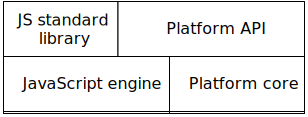
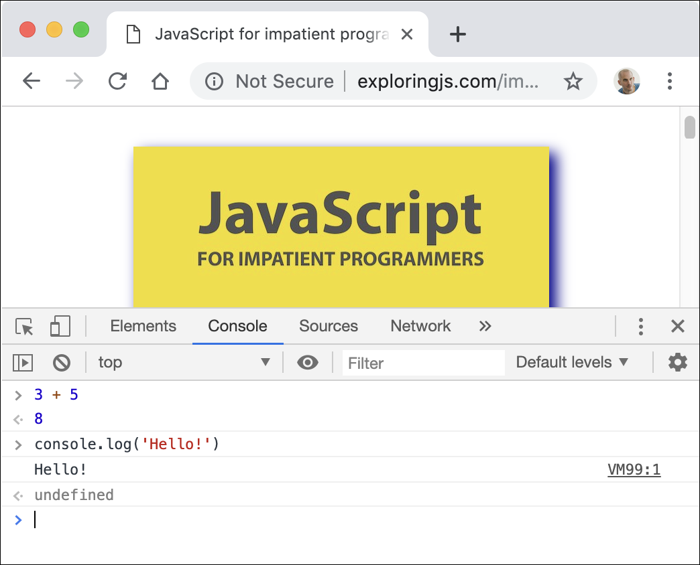
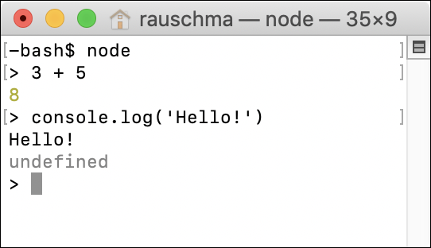

## 5.概览

> 原文： [http://exploringjs.com/impatient-js/ch_big-picture.html](http://exploringjs.com/impatient-js/ch_big-picture.html)
> 
> 贡献者：[kj415j45](https://github.com/kj415j45)

在本章中，我想描绘一下大局：您将在本书中学到什么？它如何适应 Web 开发的整体环境？

### 5.1 您将在本书中学到什么？

本书讲授 JavaScript 语言。它只关注语言，但偶尔会看一看两个可以使用 JavaScript 的平台：

*   网页浏览器
*   Node.js

Node.js 在三个方面对 Web 开发很重要：

*   通过它您可以用 JavaScript 编写服务器端软件。
*   您还可以使用它为命令行编写软件（想想 Unix shell、Windows PowerShell 等）。许多与 JavaScript 相关的工具都基于 Node.js（并通过其执行）。
*   Node 的软件注册处 npm 已成为安装工具（如编译器和构建工具）和库的主要方式 - 甚至用于客户端开发。

### 5.2 浏览器和 Node.js 的结构

图 2：两个 JavaScript 平台，*Web 浏览器* 和 *Node.js* 的结构。API“标准库”和“平台 API”都托管在基础层之上，它具有 JavaScript 引擎和特定于平台的“核心”。

两个 JavaScript 平台 _Web 浏览器_ 和 _Node.js_ 的结构相似（图 [2](#fig:javascript-platforms) ）：

*   基础层由 JavaScript 引擎和特定于平台的“核心”功能组成。
*   在此基础之上托管了两个 API：
    *   JavaScript 标准库是 JavaScript 的一部分，在引擎之上运行。
    *   平台 API 也可以从 JavaScript 获得 - 它提供对特定于平台的功能的访问。例如：
        *   在浏览器中，如果要执行与用户界面相关的任何操作，则需要使用特定于平台的 API 比如：响应鼠标点击、播放声音等。
        *   在 Node.js 中，特定于平台的 API 允许您读取和写入文件，通过 HTTP 下载数据等。

### 5.3 试用 JavaScript 代码

您有很多选项可以快速运行 JavaScript。以下小节介绍了其中的一些内容。

#### 5.3.1 浏览器控制台

Web 浏览器具有所谓的 _控制台_ ：交互式命令行，您可以通过`console.log()`打印文本，并在其中运行代码段。如何打开控制台因浏览器而异。图 [3](#fig:chrome-console) 显示了 Google Chrome 的控制台。

要了解如何在 Web 浏览器中打开控制台，您可以搜索“«浏览器名称» 控制台”。这些是一些常用 Web 浏览器的页面：

*   [Apple Safari](https://developer.apple.com/safari/tools/)
*   [谷歌浏览器](https://developers.google.com/web/tools/chrome-devtools/console/)
*   [Microsoft Edge](https://docs.microsoft.com/zh-cn/microsoft-edge/devtools-guide/console)
*   [Mozilla Firefox](https://developer.mozilla.org/zh-TW/docs/Tools/Web_Console/Opening_the_Web_Console)

图 3：使用“Google Chrome”访问网页时打开控制台（在窗口的下半部分）。

#### 5.3.2 Node.js REPL

_REPL_ 代表 _读取（Read） - 执行（Eval） - 打印（Print） - 循环（Loop）_ ，基本上是指 _命令行_ 。要使用它，必须首先通过命令`node`从操作系统命令行启动 Node.js。然后与它的交互看起来如图 4 所示。图 [4](#fig:nodejs-repl) ：`>`之后的文本是从用户输入的;其他一切都是从 Node.js 输出的。

图 4：开始使用 Node.js REPL（交互式命令行）。

 **阅读：REPL 互动**

我偶尔通过 REPL 交互演示 JavaScript。然后我还使用大于号（`>`）来标记输入。例如：

#### 5.3.3 其他选择

其他选择包括：

*   可让您在网络浏览器中体验 JavaScript 的众多网络应用。例如，[Babel 的 REPL](https://babeljs.io/repl)。
*   还有用于运行 JavaScript 的本机应用程序和 IDE 插件。

### 5.4 JavaScript 资源

当您对 JavaScript 有疑问时，网络搜索通常会有所帮助。我可以推荐以下在线资源：

*   [MDN 网络文档](https://developer.mozilla.org/en-US/)：涵盖各种网络技术，如 CSS，HTML，JavaScript 等。一个很好的参考。
*   [探索 JS](http://exploringjs.com) ：包含我的 JavaScript 书籍。
*   [Node.js Docs](https://nodejs.org/en/docs/) ：记录 Node.js API。

### 5.5 进一步阅读

*   本书末尾的[“后续步骤”](ch_remaining-chapters-preview.html)一章，更全面地介绍了 Web 开发。
